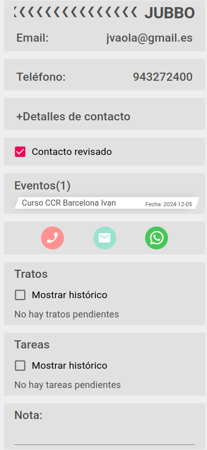

# Contacto

Los contactos son personas que generalmente representan a uno o varios clientes.

Podemos acceder a contactos desde varios sitios:

### Webapp
  + Contactos
  + Clientes
  + Cursos
  + Trato(*editar contacto*)

### Dashboard Smartsales
  + Ficha de evento
  + Agenda:
    + Buscador
    + Contactos de cursos
    + Contactos más activos en últimos meses

### Mensaje: El contacto no está en tu lista
Al acceder a la ficha de contacto podremos acceder a sus datos si este está asociado a nuestra ficha de agente comercial.

Un contacto está asociado a un agente si ocurre alguno de estos casos:
  + Que está ascociado en la tabla de contactos x agente
  + Que como agente somos responable del código postal del contacto (nuestro código está asociado al CP en la tabla de códigos postales)

Solo podemos ver los apartados *Tratos* y *Tareas* si el contacto esta asociado.

Si podremos ver el apartado *Eventos(número de interacciones)* si existe actividad reciente o el texto *Sin participación en eventos* si no la hubiera.

Si desplegamos el apartado veremos un listado de los eventos en los que el contacto participó, indicando el nombre del evento y la fecha de inicio del mismo. Al clicar sobre un evento accederemos los datos del evento.

## Asociar un contacto
Al crear un contacto nuevo este se asociará al agente ceador. Para asociar un contacto ya exitente, se puede hacer en el alta de un trato(*no para tratos de campañas*), si el trato tiene un contacto asociado, comprobaremos si este está asociado al agente conectado y si no lo está se preguntará si queremos asociarlo.