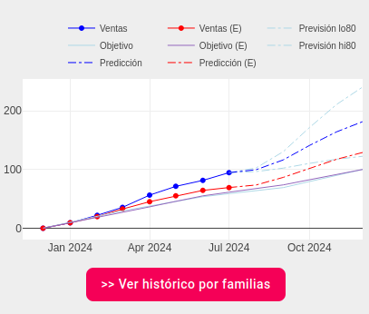

# Historico previsión

Aquí podemos ver un gráfico que representa el número de ventas mensuales, ventas objetivo y predicción de ventas en el año actual. Mostrando en azul los datos del agente y en rojo los datos de la empresa(*E*).

El dato es un procentaje entre el valor real obtenido y el valor objetivo establecido para ese mes. Así podemos comprobar con un vistazo rápido nuestra eficiencia y la comparación de la misma frente a la general de la empresa.

[Volver al Índice](./index.md)