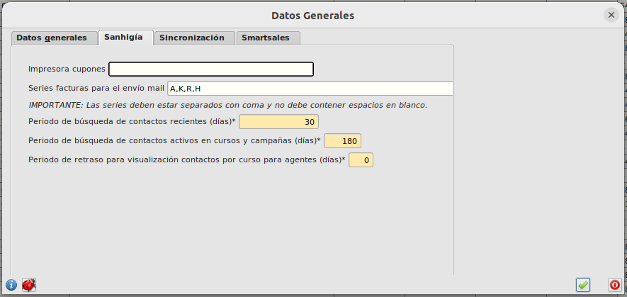

# Configurar parámetros de búsqueda

Por defecto, los periodos establecido de búsqueda de contactos para generar la notificación de **contactos de cursos o más activos** en SmartSales está establecido en 30 días para contactos de cursos, en 180 para contactos más activos.

También podemos establecer el número de días de retraso por defecto para la publicación de los contactos asociados al evento a los agentes. Es decir al crear un nuevo evento la fecha de publicación será la de la fecha del evento más los días parámetrizados en este campo. Esta fecha podrá ser modificada por el usuario en todo momento.

Para contactos de cursos solo se buscará aquellos contactos que hayan asistido a un evento cuya fecha de inicio este establecida en los últimos 30 días y para contactos más activos se buscará aquellos contactos que hayan asistido a un evento o forme parte de una campaña cuya fecha de inicio este establecida en los últimos 180 días .

## ¿Cómo modifico el periodo de búsqueda y/o el retraso?

* Abrimos el formulario **Area de Facturación/Facturación/Configuración** y seleccionamos la pestaña **Sanhigía**. Introducimos el número de días que queremos establecer y pulsamos el botón de confirmación.

[Volver](./agenda.md)