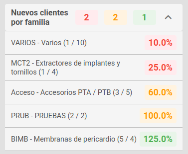

# Progreso


Aquí podemos ver una serie de valores para saber cuál es el progreso de las ventas para el agente conectado, para el cálculo de estos valores, vamos a utilizar unas fórmula matématicas que usarán los siguientes conceptos.

- Ventas en el periodo seleccionado(**Vendido**):

  - Es la suma de los totales de las facturas correspondientes al agente conectado y con fecha incluida en el periodo seleccionado.

- Ventas del año anterior en el periodo seleccionado(**Vendido año anterior**):

  - Es la suma de los totales de las facturas correspondientes al agente conectado y con fecha incluida en el periodo seleccionado del año anterior.

- Objetivo de ventas(**Objetivo**):
  - Es la suma de los objetivos de ventas marcados para el agente conectado en los trimestres seleccionados.

Podemos elegir el intervalo de tiempo que queremos consultar, podemos seleccionar los trimestres deseados clicando para marcar/desmarcar o introducir una fecha personalizada.

Si el agente conectado es **superusuario** los valores usados corresponden a todos los agentes.

## Valores cálculados

Para el cálculo de cada valor usaremos las siguientes fórmulas:

- **Porcentaje**:

```xls
  (Vendido / Objetivo) * 100
```

- **Total ventas**:

```xls
  Vendido
```

- **Incremento/año**:

```xls
  ((Vendido - Vendido año anterior) * 100) / Vendido año anterior
```

```
Para este valor, si estamos usando la opción de trimestres, cabe aclarar que solo se tendrán en cuenta los días hasta la fecha actual. Por ejemplo, si estamos a día 18 de Febrero y tenemos marcados 'T1' y 'T2' no utilizaremos los datos para las ventas del año anterior más allá del 18 de Febrero. Para establecer periodos superiores usaremos la opción de fecha personalizada.
```

Si el agente conectado es **superusuario** los datos mostrados corresponden a todos los agentes.

# KPI

## Nuevos clientes por familia

Mostramos el rendimiento en la facturación a nuevos clientes según determinado grupo de artículos por familia y opcionalmente subfamilia.

Mostramos un resumen de los datos que representan (A / B / C), donde:

- A es el total de familias en las que los nuevos clientes alcanzados están por debajo del 50% del objetivo (color rojo)
- B es el total de familias en las que los nuevos clientes alcanzados están entre el 50% y el 100% del objetivo (color naranja)
- C es el total de familias en las que los nuevos clientes alcanzados están por encima del 100% del objetivo (color verde)

Si desplegamos, podemos ver en detalle un listado con los siguientes datos para cada familia asociada al KPI para el agente:

Código y nombre de la familia - subfamilia (x / X) donde:

- x Es el número de clientes alcanzado
- X Es el número de clientes objetivo.



## Unidades por producto

Mostramos el rendimiento en la facturación sobre artículos concretos. Vemos un resumen de los datos que representan (A / B / C), donde:

- A es el total de productos en los que las unidades alcanzadas están por debajo del 50% del objetivo (color rojo)
- B es el total de productos en los que las unidades alcanzadas están entre el 50% y el 100% del objetivo (color naranja)
- C es el total de productos en los que las unidades alcanzadas están por encima del 100% del objetivo (color verde)

Si desplegamos, podemos ver en detalle un listado con los siguientes datos para cada producto asociada al KPI para el agente:
Referencia y nombre del producto (x / X) donde:

- x Es el total de productos alcanzado
- X Es el total de productos objetivo.


[Volver al Índice](./index.md)
