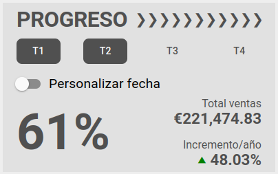

# Progreso



Aquí podemos ver una serie de valores para saber cuál es el progreso de las ventas para el agente conectado, para el cálculo de estos valores, vamos a utilizar unas fórmula matématicas que usarán los siguientes conceptos.

* Ventas en el periodo seleccionado(**Vendido**): 
  - Es la suma de los totales de las facturas correspondientes al agente conectado y con fecha incluida en el periodo seleccionado.

* Ventas del año anterior en el periodo seleccionado(**Vendido año anterior**):
  - Es la suma de los totales de las facturas correspondientes al agente conectado y con fecha incluida en el periodo seleccionado del año anterior.

* Objetivo de ventas(**Objetivo**):
  - Es la suma de los objetivos de ventas marcados para el agente conectado en los trimestres seleccionados. 

Si el agente conectado es **superusuario** los valores usados corresponden a todos los agentes.  

## Valores cálculados

Para el cálculo de cada valor usaremos las siguientes fórmulas:

* **Porcentaje**:
``` xls
  (Vendido / Objetivo) * 100
```
  


* **Total ventas**:
``` xls
  Vendido
```

* **Incremento/año**:
``` xls
  ((Vendido - Vendido año anterior) * 100) / Vendido año anterior
```

Si el agente conectado es **superusuario** los datos mostrados corresponden a todos los agentes.

Podemos elegir el intervalo de tiempo que queremos consultar, podemos seleccionar los trimestres deseados clicando para marcar/desmarcar o introducir una fecha personalizada.

[Volver al Índice](./index.md)