# Tareas

## Crear tarea
Podemos crear tareas para un agente asociadas a un trato clicando en el botón lateral derecho *'+ TAREA'* de la ficha del [trato](../tratos/index.md).

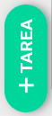

Rellenamos los datos seleccionando el tipo de tarea(*llamada, email, whatsapp, cita*) y al clicar '*confirmar*' se creará una tarea asociado al agente logeado.

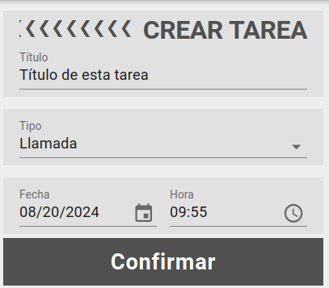

O si estamos en la pantalla de listado de tratos de una campaña, podemos crear una tarea con de un tipo específico clicando en el tipo de tarea desplegando el menú de acciones de cada elemento del listado.  

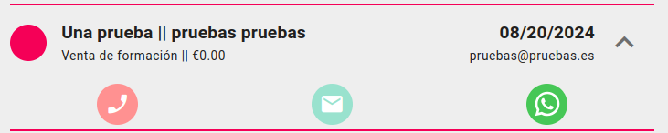

El tipo ya aparecerá seleccionado y debemos elegir si realizar la tarea ahora o más tarde. Si clicamos '*hacer ahora*' navegaremos a la ficha de la tarea y el equipo realizará automaticamente el tipo de acción asociada a la tarea(*hacer llamada, abrir el servidor de correo electrónica, mandar un mensaje de whatsapp*).

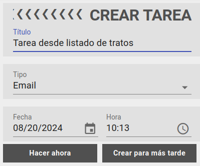

## Ficha de tarea

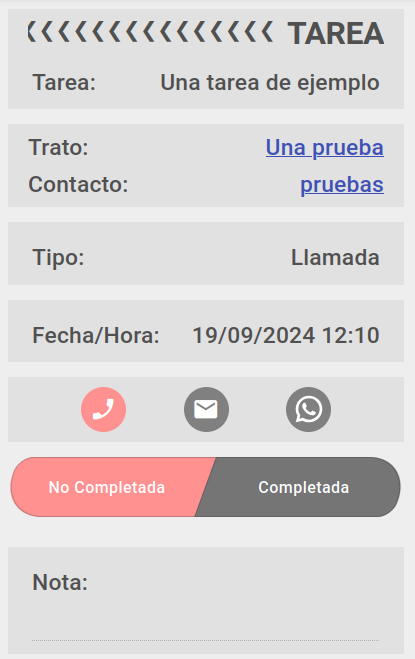

En la ficha de la tarea podemos ver una serie de cajas con la información de la misma.

- Título (*editable*)
- Datos del trato (*no editable*):
  - Trato al que pertenece(clicable para navegación)
  - Contacto o cliente(clicable para navegación)
- Tipo de tarea (*editable*)
- Fecha y hora (*editable si no está completada*)
- Acciones (*hacer llamada, abrir el servidor de correo electrónica, mandar un mensaje de whatsapp*)
- Estado (*editable*)
- Nota (*editable*)

### Completar tarea

 Para poder completar la tarea el usuario debe haber concedido permisos de ubicación.

 Al completar tarea debemos indicar la fecha y la hora de finalización de la misma.

 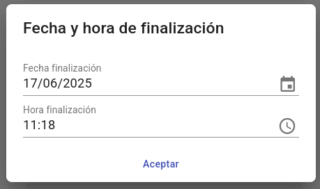

 Se nos ofrecerá la opción de crear una siguiente tarea seleccionado el tipo.

 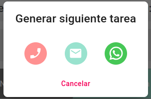

 Si cancelamos esta opción y la tarea completada es la última asociada al trato, podremos cambiar el [estado del trato asociado](../tratos/index.md) desde esta misma pantalla.

  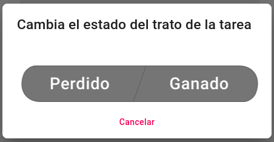

### Sincronizar tareas con calendario de google

Al crear una tarea veremos el siguiente mensaje si todavía no hemos sincronizado con una cuenta de google.

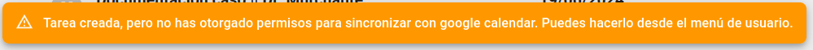

Para hacerlo debemos visitar la pantalla de usuario desde el menú lateral derecho. En ella veremos los datos del usuario y un botón con el que podremos dar permisos a la aplicación para acceder a los calendarios de la cuenta de google que deseemos. 

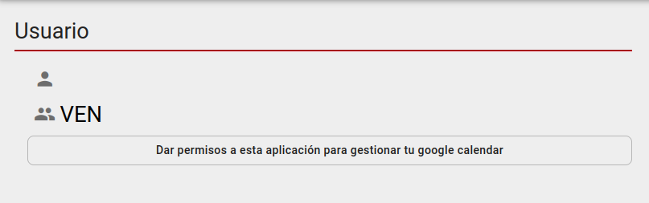

Una vez completado el proceso, cada vez que creemos una tarea, también se creará un evento con el mismo título en nuestro calendario para la fecha y hora elegidas. En la descripción del evento encontraremos la una url con la que redireccionar a la tarea del CRM.

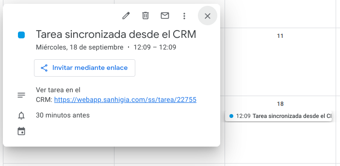  

Para revocar los permisos concedidos podemos hacerlo desde nuestra cuenta de google. Está información también la podemos ver en la pantalla de usuario una vez concedidos los permisos.

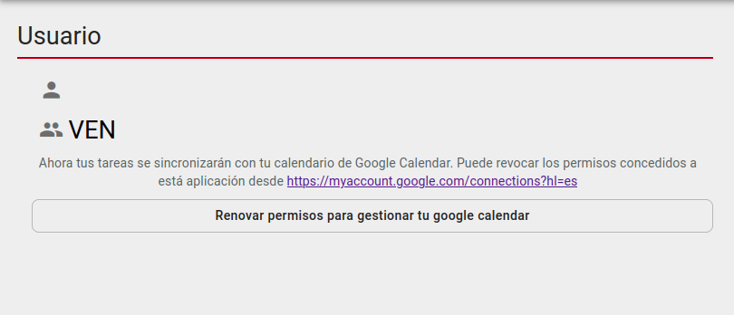

[Volver al Índice](../../../index.md)