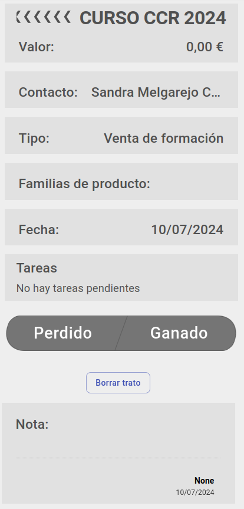
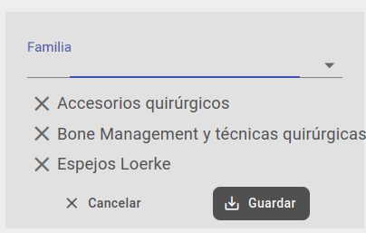

# Tratos

## Ver tratos de una campaña

Se pueden ver un trato asociado al agente logeado desde la sección [agenda](./dashboard/agenda.md) del dashboard, seleccionado en el listado mostrado o clicando en '*ver todos*'.

## Trato

En el trato podemos ver una serie de cajas con la información del mismo.
- Nombre (*no editable*)
- Valor (*editable*)
- Contacto (*editable*) o cliente (*no editable*) asociado
- Tipo de trato (*editable*)
- Fecha (*editable*)
- Tareas (*editable*)
- Estado (*editable*)
- Borrar (*editable*)
- Nota (*editable*)

### Contacto

Podemos añadir un contacto de la lista usando el buscador o crear un nuevo contacto que una vez creado aparacerá selecionado. Debemos clicar el botón guardar.

### Tipo de trato

Aquí podemos seleccionar el tipo de trato entre las opciones. Cada tipo de trato tiene asocidas unas características. Que se pueden definir en la sección [tipos de trato](./tipostrato.md).

### Familias de producto

Aquí podemos asociar al trato una lista de familias de producto, usando el selector podemos añadir familias a la lista y clicando en el aspa de la izquierda podemos borrar de la lista. Para que los cambios sean efectivos debemos clicar el botón '*guardar*'.

### Tareas

Aquí veremos un listado de las [tareas](./tareas.md) asociadas a este trato. Para cada tarea se indicará el nombre(*tachado si está completada*), fecha, hora, tipo. 

Podemos crear una tarea clicando en el botón del lateral derecho '**+ Tarea**'. Esta opción no está habilitada para el grupo de *marketing*.

### Estado

Aquí podemos cambiar el estado del trato. Si clicamos el estado *Perdido*, debemos seleccionar una causa de pérdida del trato que están asociadas al tipo de trato. La causa se mostrará debajo del estado, si el tipo de trato es '*venta producto* y se puede editar.

Para ganar un trato debemos clicar en el botón si el tipo de trato no está configurado para '*exigir generación de pedido para ganar trato*' en la sección [tipos de trato](./tipostrato.md), si lo está tendremos que generar un pedido o generar un presupuesto y aprobarlo generando un pedido, así el trato cambiará a *ganado* automáticamente. 

### Borrar trato

Veremos el botón *borrar* si el estado del trato es diferente de '*ganado* y el usuario logeado es el agente asociado al mismo o si el grupo al que pertenece el usuario logeado tiene permisos para borrar tratos. 

### Asociar pedido

Veremos el botón *Asociar pedido* si el tipo de trato esta configurado para '*exigir generación de pedido para ganar trato*' en la sección [tipos de trato](./tipostrato.md) y no tiene ya asociado ningún pedido ni ningún presupuesto.

Al clicar en el botón se desplegará un modal en el que podremos seleccionar un pedido existente asociado al agente logeado y también al cliente del trato si este tuviera uno asociado. 

Al confirmar se ganará el trato, se asociará el pedido al trato y si el trato no tuviera un cliente asociado se le asociaría el del pedido.

## Crear trato

En el formulario de creación de trato introduciremos la información del nuevo trato. Existen algunos campos obligatorios para poder confirmar la creación del mismo, si estos campos no tienen valor el botón 'Confirmar' no se podrá pulsar. Los campos obligatorios son: 

- Título
- Fecha(por defecto el día actual)
- Cliente o contacto
- Tipo
- Notas(solo si el tipo seleccionado es el configurado para '*Colaboración*' desde el ERP, en el formulario **Area de Facturación/Facturación/Configuración**)

[Volver al Índice](./index.md)