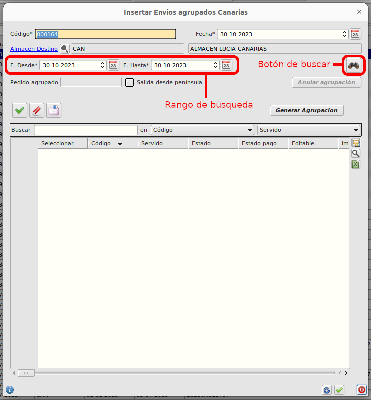
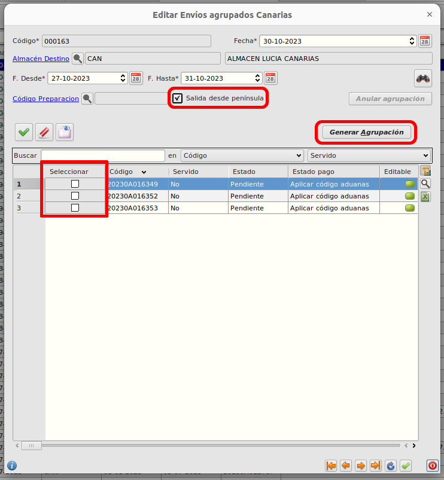
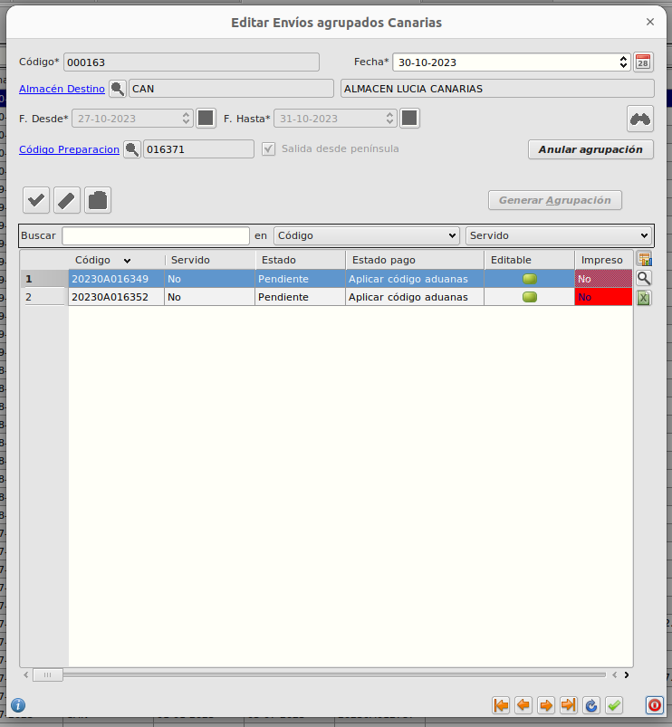
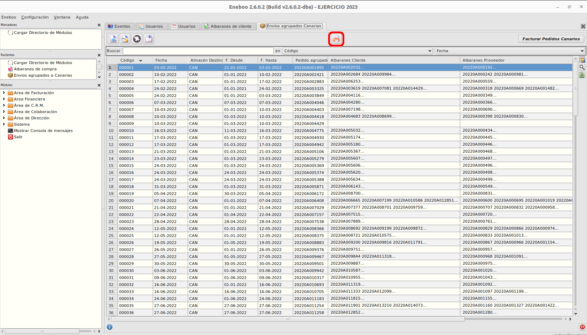
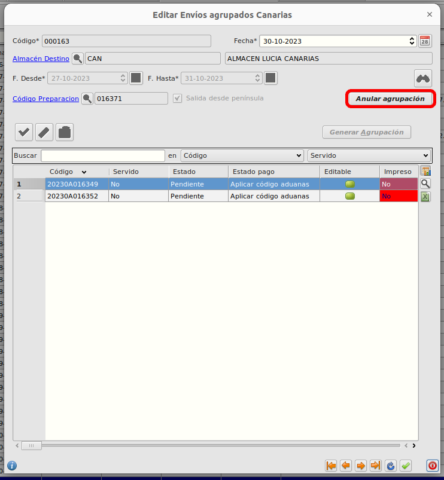

# Agrupaciones de pedidos a Canarias

## Crear una agrupación desde península

- Abrimos el formulario de 'envios agrupados Canarias', y creamos un nuevo registro.  
  Ruta: **Área de Facturación -> Facturación -> Envíos agrupados a Canarias**

- Introducimos las fechas para acotar el rango de búsqueda de los pedidos que queremos agrupar, y pulsamos en el botón resaltado en la imagen anterior para que aparezcan los pedidos seleccionables.
  - Los pedidos que se puedan agrupar aparecerán entonces en la tabla con un campo para seleccionarlos en la primera columna.

- Tendremos que seleccionar los pedidos que queramos agrupar. Una vez los tengamos todos, pulsamos en el botón 'Generar Agrupación', asegurándonos de dejar marcado el campo 'Salida desde península'.
  - Se creará la preparación asociada a la nueva agrupación de pedidos.
  - Los pedidos se quedarán asociados a la preparación creada.
  - Se deshabilitarán los botones de 'Generar Agrupación' y 'Salida desde península'. Y se habilitará el botón 'Anular agrupación'.

- Preparar la preparación generada como se haría normalmente.
- Generamos albaranes y facturas de la preparación como haríamos normalmente.

### Cómo generar impreso desde península

Ya que al realizar la agrupación desde península no se crea un pedido asociado que se pueda imprimir, se ha añadido un nuevo botón de impresión en el formulario de 'envios agrupados Canarias'.

## Crear una agrupación desde Canarias

- Abrimos el mismo formulario y buscamos los pedidos a agrupar de la misma forma que para las agrupaciones desde península
- Pulsamos el botón de 'Generar agrupación', esta vez asegurándonos de que el campo 'Salida desde península' esté desmarcado.
  - Se creará un pedido agrupado asociado a la nueva agrupación de pedidos.
  - Los pedidos se quedarán asociados al nuevo pedido agrupado.
  - Se deshabilitarán los botones de 'Generar Agrupación' y 'Salida desde península'. Y se habilitará el botón 'Anular agrupación'.
- Se prepara el pedido agrupado normalmente.
- Generamos el albarán y albarán espejo.
- Generamos las facturas de los pedidos incluidos.

### Cómo generar impreso desde Canarias

Como en este caso se crea un pedido asociado a la agrupación, podemos generar el impreso normalmente desde el formulario de 'pedidos de venta'. Pero también nos puede servir el nuevo botón de impresión de 'envios agrupados Canarias'.

### Deshacer agrupaciones

Para deshacer agrupaciones simplemente tenemos que abrir el formulario de edición de la agrupación que queramos deshacer, y entonces pulsar el botón 'Anular agrupación'. Nos aparecerá un mensaje emergente para confirmar si queremos deshacer la agrupación, pulsamos aceptar.

Es el mismo método tanto para agrupaciones con salida desde península como con salida desde Canarias.

[Volver al Índice](../../../index.md)
