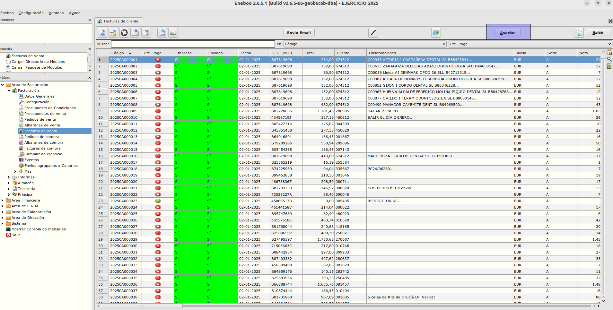
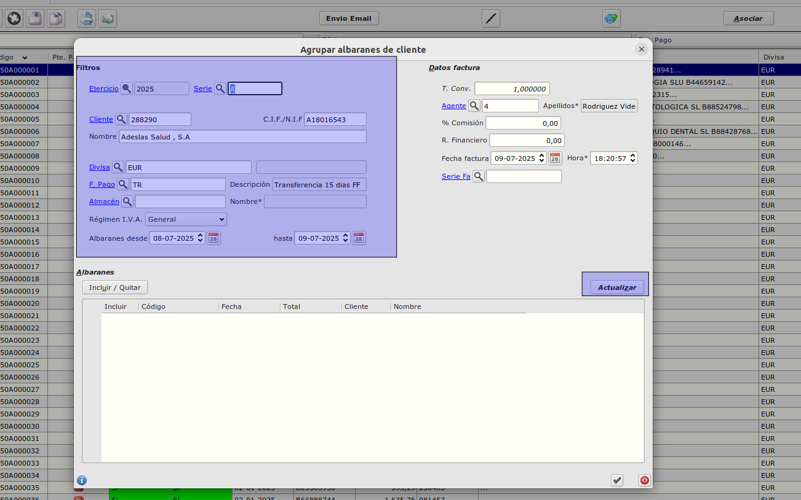

# Asociar albaranes en facturas de clientes

## Crear una agrupación de albaranes

- Abrimos el formulario de 'Facturas de Venta'.  
  Ruta: **Área de Facturación -> Facturación -> Facturas de Venta**


- Pulsamos el botón de 'Asociar'.
- Se abrirá el formulario de agrupar albaranes en facturas.

- En la parte isquierda se encuentran los criterios de busquedad de los albaranes que se van a facturar.
- Una vez selecionados con el botón 'Actualizar' se carga los registros en la tabla de abajo.
- Si estan cargados correctamente los albaranes preparados para facturación se acepta el formulario y se crearan las facturas agrupados por clientes y almacen.

## Agrupación de facturas por centro

### Facturación / Principal / Clientes
Añadiremos a la pantalla los siguientes controles:
+ Agrupar facturas por centro. Sí / No. Valor por defecto _No_.

### Facturas / Agrupar albaranes
En el caso de que el cliente a facturar tenga activo el indicador _Agrupar facturas por centro_ se genere una factura por cada dirección de albarán (centro).
Cuando el cliente tenga activo el indicador _Agrupar facturas por centro_, las observaciones de la factura contengan el texto:

```
Centro: [Dirección del cliente]
```

estas observaciones se mostrarán en el informe de factura 


[Volver al Índice](../../../index.md)
