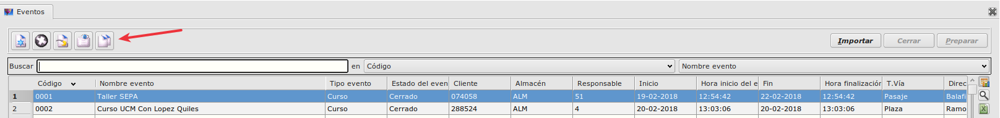

# Creación de eventos recurrentes

Cuando necesitemos crear un evento recurrente con las mísmas características que un registro ya existente seguiremos los siguientes pasos:

- Nos dirigimos al formulario de eventos. Ruta: **Área de facturación -> facturación -> eventos**

- Seleccionamos el evento que queramos copiar y pulsamos en el botón _'Copiar registro'_ situado al final de la botonera de la esquina superior izquierda del formulario.

- Se abrirá otro pequeño formulario en el que tendremos que seleccionar las fechas de inicio y fin correspondientes al nuevo evento. Las fechas tendrán que ser posteriores a la fecha de creacion del evento, y tampoco se podrá crear el evento con una fecha de inicio posterior a su fecha de fin.

- Si las fechas son válidas, cuando pulsemos _'Aceptar'_ se creará un nuevo evento con los mismos datos que el evento que seleccionamos en primer lugar, salvo por sus nuevas fechas y su estado, al cual se asignará automáticamente el valor 'Planificado'.

[Volver al Índice](../../../index.md)
