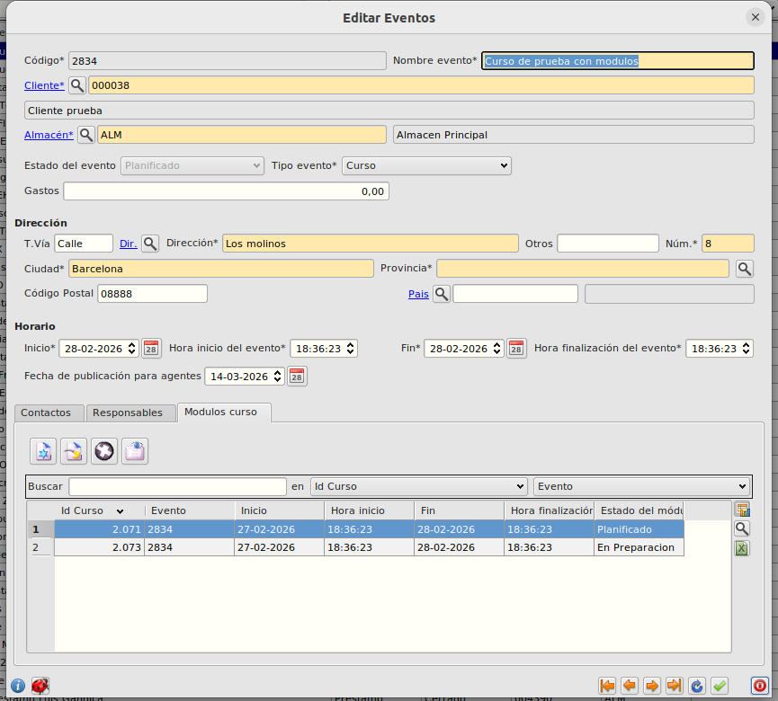
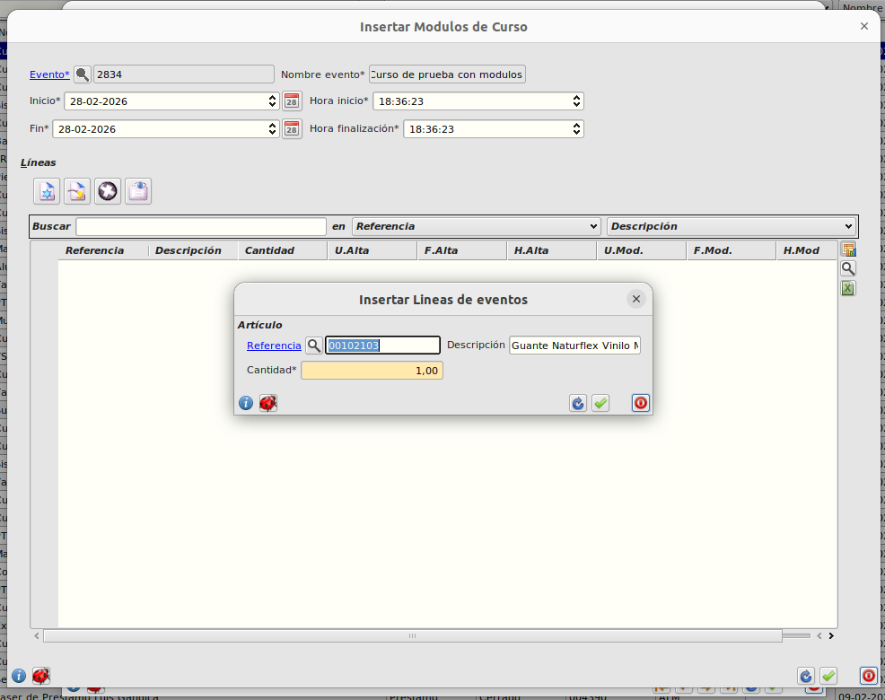

# Añadir articulos a evento

## Módulos de evento

- Desde el formulario de Módulos de evento o en la pestaña del formulario de evento podemos añadir módulos para el evento requerido y en estos módulos podremos añadir los artículos necesarios para el evento.

- Serán los módulos del evento los que podrán **preparar** los pedidos necesarios para el evento.

- Así mismo el estado del evento dependerá del **estado** de sus módulos, es decir, el evento tendrá el estado equivalente al estado más retrasado de sus módulos.

[Volver al Índice](./index.md)
