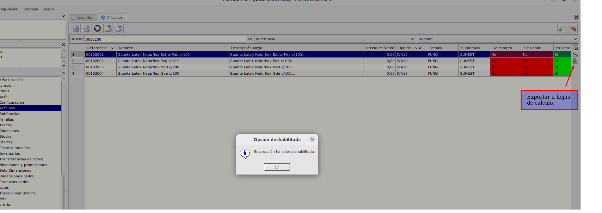
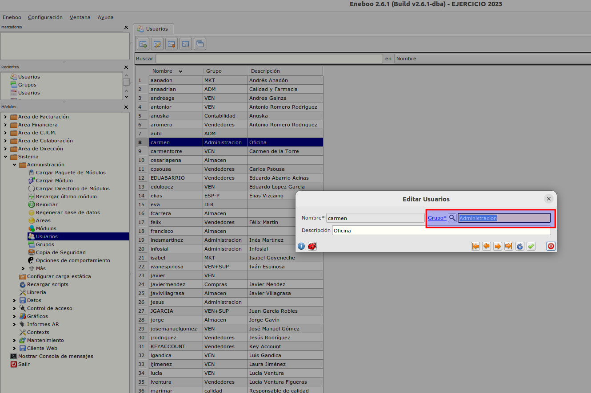

# Permisos para exportar tablas a hojas de calculo

Solo los usuarios del grupo Administracion pueden exportar tablas de Eneboo a hojas de calculo.

Se pueden añadir mas grupos. Contacta con YeboYebo para mas información.

## Añadir un usuario al grupo Administracion

* Abrimos el formulario de **usuarios** en **Sistema/Administración/Usuarios** y pulsamos *Insertar Registro* o *Modificar Regitro*.

* Indicamos el grupo *Administracion*.

* Guardamos el formulario.
