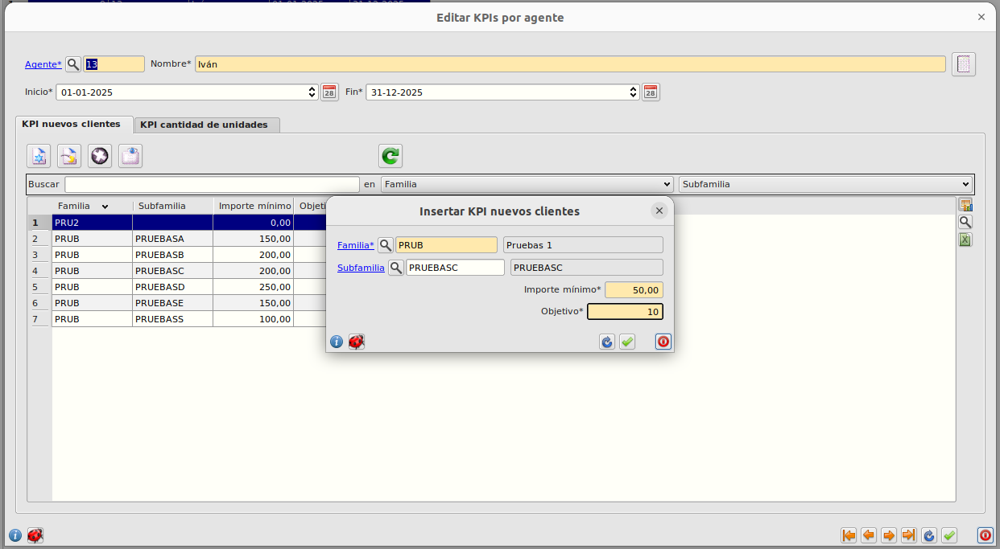
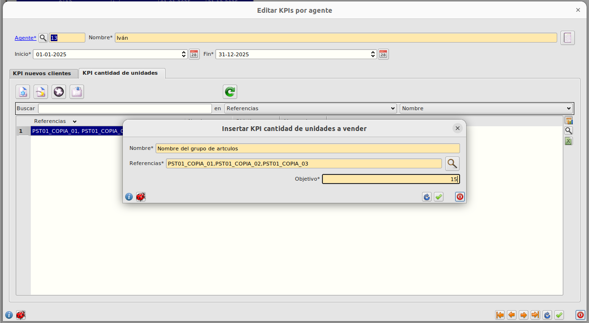

# KPIs por agente

Los KPIs por agente permiten establecer unos objetivos por cada agente comercial para un determinado período de tiempo a monitorizar.

## Crear una nuevo registro

- Abrimos el formulario de **KPIs por agente** en **Area de Facturación/Principal/KPIs agente** y pulsamos _Insertar_.

- Indicamos el agente, el período a monitorizar.

- Rellenamos las pestañas.

- Pulsamos el botón _Calcular datos_.

## Datos de cabecera

### KPI Nuevos clientes

Esta tabla muestra el rendimiento en la facturación a nuevos clientes según determinado grupo de artículos por familia y opcionalmente subfamilia. Las principales columnas son:

- **Familia**: por la que agrupar los articulos facturados a monitorear.
- **Subfamilia**: asociada a la familia por la que agrupar los articulos facturados.
- **Importe mínimo**: gastado en esa familia y/o subfamilia a partir del que contar como nuevo cliente.
- **Cantidad objetivo**: de nuevos clientes.
- **Cantidad alcanzada**: de nuevos clientes.

Todos las columnas con editables menos la columna _cantidad alcanzada_ que se cálcula autmáticamente clicando el botón general del formulario _Calcular datos_ o en el botón _recargar datos_ dentro de la sección.

### KPI cantidad de unidades

Esta tabla muestra el rendimiento en la facturación sobre artículos concretos. Las principales columnas son:

- **Referencias**: de los artículos a monitorear.
- **Descripción**: del artículo a monitorear.
- **Cantidad objetivo**: de artículos facturados.
- **Cantidad alcanzada**: de artículos facturados.

Todos las columnas con editables menos la columna _cantidad alcanzada_ que se cálcula autmáticamente clicando el botón general del formulario _Calcular datos_ o en el botón _recargar datos_ dentro de la sección.

[Volver al Índice](../../../index.md)
