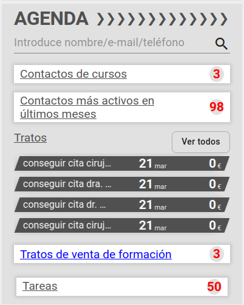

# Agenda

## Buscador

Podemos buscar un contacto tecleando parcial o completamenta el nombre, email o teléfono. También podemos clicar la lupa que mostrará el listado de contactos sin ningún filtro.

#### Listado de contactos

Contiene el listado de contactos indicando el nombre del mismo en la parte superior y en la de abajo veremos un contador de tratos abiertos del contacto y la suma del valor de los mismos. Al clicar sobre un contacto accederemos los datos del mismo.

## Contactos de cursos

#### ¿Qué es un contacto de curso?

 Son aquellos contactos que están asociados a nuestro usuario por código postal o contactos que no tienen asignado ningún código postal y que han tenido una interacción o asistencia a un curso o evento en los últimos _N_ días, siendo _N_ un valor parametrizable en el ERP.  [Parametrizar días](./periodobusqueda.md).

La caja *contactos de cursos* será visible siempre que tengamos al menos un contacto de este tipo.

#### Listado de contactos de cursos

Si clicamos en la caja veremos la pantalla de *Contactos cursos* que contiene el listado de contactos recientes indicando el nombre del evento y la fecha de la última interacción que podemos ver en detalle si clicamos en la flecha. Al clicar sobre un contacto accederemos los datos del mismo.

#### Datos del contacto

Si el contacto está asociado a nuestra lista como agente o a nuestros códigos postales, veremos los datos del contacto, incluyendo el apartado *Eventos(número de interacciones)* si existe actividad reciente o el texto *Sin participación en eventos* si no la hubiera.

Si desplegamos el apartado veremos un listado de los eventos en los que el contacto participó, indicando el nombre del evento y la fecha de inicio del mismo. Al clicar sobre un evento accederemos los datos del evento.

#### Datos del evento

Veremos el nombre del evento en la parte superior y un listado de los productos que se promocionaron en el evento, indicando nombre y refencia del producto.

## Contactos más activos en últimos meses

#### ¿Qué es un contacto activo?

 Son aquellos contactos que están asociados a nuestro usuario por código postal o contactos que no tienen asignado ningún código postal y que han tenido una interacción o asistencia con un curso/evento o una campaña en los últimos _N_ días, siendo _N_ un valor parametrizable en el ERP.  [Parametrizar días](./periodobusqueda.md).

La caja *contactos más activos en últimos meses* será visible siempre que tengamos al menos un contacto de este tipo.

[Volver al Índice](./index.md)