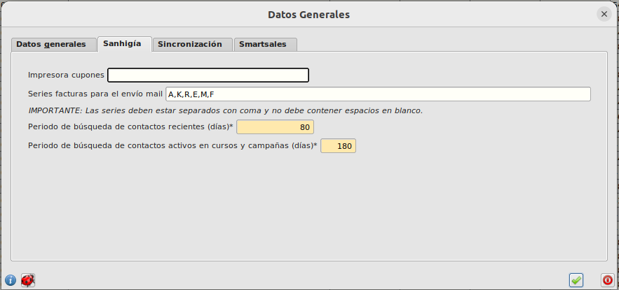

# Configurar periodo de búsqueda

Por defecto, los periodo establecido de búsqueda de contactos para generar la notificación de **contactos de cursos o más activos** en SmartSales está establecido en 30 días y 180 respectivamente.

Para contactos de cursos solo se buscará aquellos contactos que hayan asistido a un evento cuya fecha de inicio este establecida en los últimos 30 días y para contactos más activos se buscará aquellos contactos que hayan asistido a un evento o forme parte de una campaña cuya fecha de inicio este establecida en los últimos 180 días .

## ¿Cómo modifico el periodo de búsqueda?

* Abrimos el formulario **Area de Facturación/Facturación/Configuración** y seleccionamos la pestaña **Sanhigía**. Introducimos el número de días que queremos establecer y pulsamos el botón de confirmación.

[Volver](./agenda.md)