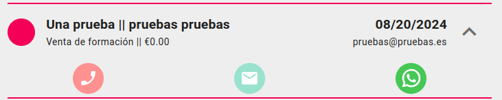

# Tareas

## Crear tarea
Podemos crear tareas para un agente asociadas a un trato clicando en el botón lateral derecho *'+ TAREA'* de la ficha del [trato](./tratos.md).

Rellenamos los datos seleccionando el tipo de tarea(*llamada, email, whatsapp, cita*) y al clicar '*confirmar*' se creará una tarea asociado al agente logeado.

O si estamos en la pantalla de listado de tratos de una campaña, podemos crear una tarea con de un tipo específico clicando en el tipo de tarea desplegando el menú de acciones de cada elemento del listado.  

El tipo ya aparecerá seleccionado y debemos elegir si realizar la tarea ahora o más tarde. Si clicamos '*hacer ahora*' navegaremos a la ficha de la tarea y el equipo realizará automaticamente el tipo de acción asociada a la tarea(*hacer llamada, abrir el servidor de correo electrónica, mandar un mensaje de whatsapp*).

## Ficha de tarea

En la ficha de la tarea podemos ver una serie de cajas con la información de la misma.

- Título (*editable*)
- Datos del trato (*no editable*)
- Tipo de tarea (*editable*)
- Fecha y hora (*editable*)
- Acciones (*hacer llamada, abrir el servidor de correo electrónica, mandar un mensaje de whatsapp*)
- Estado (*editable*)
- Nota (*editable*)

### Completar tarea

 Al completar tarea se nos ofrecerá la opción de crear una siguiente tarea seleccionado el tipo.

 

 Si cancelamos esta opción y la tarea completada es la última asociada al trato, podremos cambiar el [estado del trato asociado](./tratos.md) desde esta misma pantalla.

  

[Volver al Índice](./index.md)