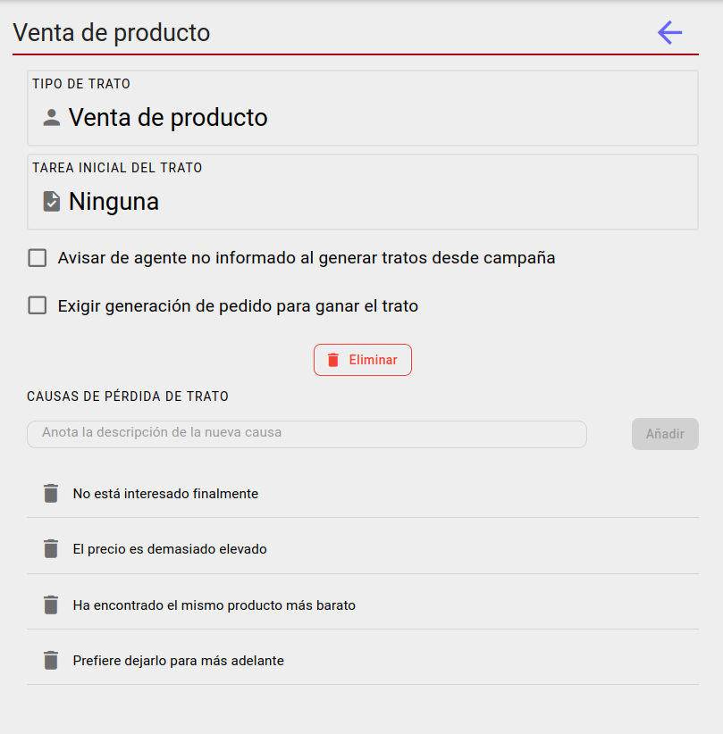

# Configuración de tipos de trato

## Tarea inicial del trato

Para los tipo de tratos que tienen asignado un agente por defecto para los tratos, al generar tratos automáticamnete desde una campaña se creará una tarea inicial asociada a ese trato y ese agente del tipo indicado en este selector, siempre que sea diferenta a *ninguna*. 

## Avisar de agente no informado

Si este check está marcado al generar tratos automáticamnete desde una campaña se comprobará si la misma tiene informado el campo *agente tratos* y si no es así se mostrará un mensaje de aviso. 

## Añadir causas de perdida de trato

Se pueden añadir tantas posibles causa de pérdida del trato como sea necesario.

[Volver al Índice](./index.md)