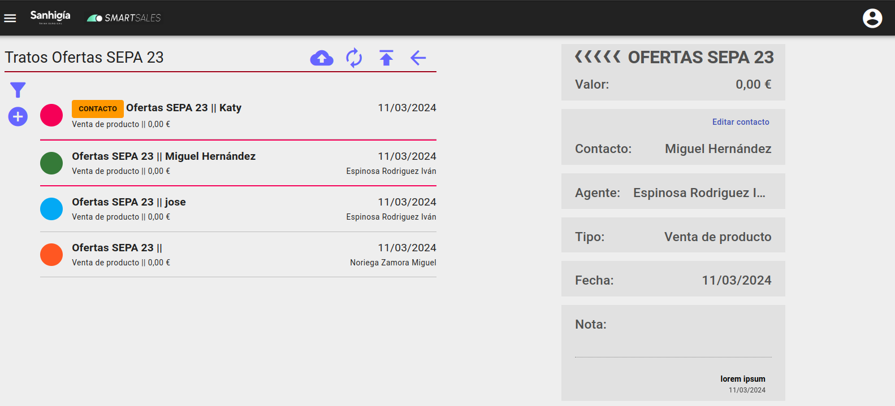
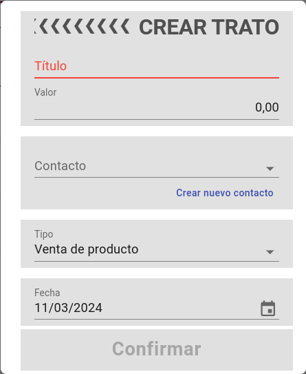
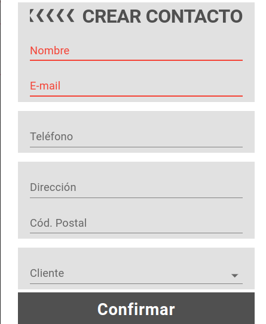
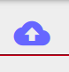
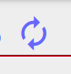
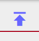

# Tratos de Campañas

## Ver tratos de una campaña

Se pueden ver los tratos de una campaña desde el boton Ver tratos en una campaña

Los colores del avatar representan:

- Rojo si el campo Estado asignación agente es Sin agente
- Naranja si el campo Estado asignación agente es Auto(Se a asignado automáticamente por el codigo postal del contacto)
- Verde si el campo Estado asignación agente es Asignado
- Azul si el campo Estado asignación agente es Publicado

## Creación manual de tratos de campaña

Pulsando sobre el icono "+" en la parte izquierda, se abre el formulario para ingresar un nuevo trato para la campaña en la que estemos.

La fecha por defecto es la de hoy.

El tipo de trato es que se indique por defecto en la campaña.

Es posible crear un nuevo contacto si es para un contacto no existente.

## Creación tratos de campaña desde fichero excel

Pulsando el botón

Se puede seleccionar un fichero excel con información de contactos, el sistema creara un trato por cada contacto del fichero que no tenga ya un trato para la campaña, si el email del contacto no está en el sistema creará un contacto nuevo.
Los tratos creados automáticamente no tendran agente asignado.
Si los datos de contacto del excel no coinciden con los datos almacenados, se pueden ver las diferencias desde el boton resolver diferencias sobre el campo de contacto.

El formato debera ser xlsx y contener los datos en este orden:

nombre y apellidos | telefono | email | ciudad | codpostal | fecha y hora | observaciones | familia productos interesado

## Asignar agente a tratos automáticamente por código postal

Pulsando el botón

Se asignara agente a los tratos automaticamente por el código postal del contacto.

## Publicar tratos

Pulsando el botón

Se publicaran automáticamente todos los tratos que esten en estado Asignado.

## Ficha trato

La funcionalidad de los tratos de una campaña es similar a la de cualquier [trato](./tratos.md), salvo que dependiendo del tipo de campaña podría estar asociado a un cliente en vez a un contacto.

[Volver al Índice](./index.md)