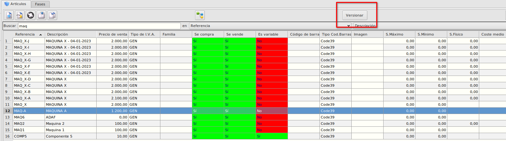
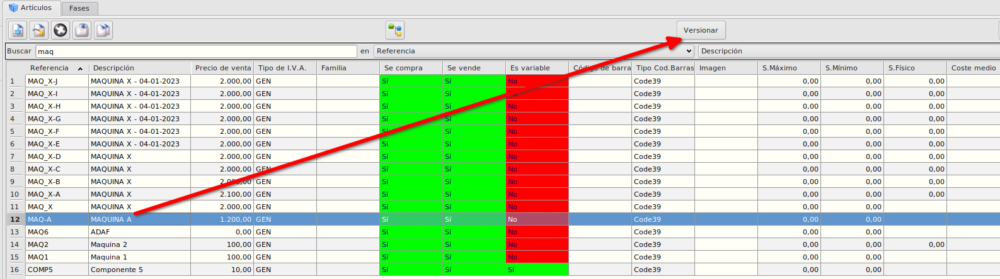
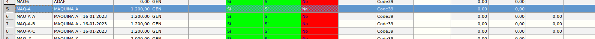

# Versionado de máquina
* Desde el maestro de artículos podemos crear una versión de una determinada máquina

* Teniendo seleccionado la máquina pulsaremos sobre el botón **Versionar**.

* Se creará una copia de la máquinar con el código de la máquina seguido de un guión (**-**) y seguido de una letra consecutiva a la última versión. La descripción será la misma que tenía seguido con la fecha de hoy. En nuestro ejemplo la máquina tenía como código MAQ-A y al versionar se ha creado una nueva máquina con el codigo MAQ-A-A, si versionamos otra vez sería MAQ-A-B, MAQ-A-C...

