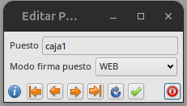

# Manual Firma de albaranes en puesto web

## Configuración de puestos de firma

- Es necesario configurar en **puestos de firma** para cada usuario que vaya a firmar desde la WEBAPP. Para ello debemos ir a la parte del ERP la cual se encuentra en **Area de facturación -> Facturacion -> Puestos de firma**

- Crear un registro o modificar existente para seleccionar el modo de firma como WEB

- Una vez tengamos como puesto local seleccionado un puesto WEB, cuando vayamos a firmar un albaran, se quedara esperando la firma en WEB(No cerrar la ventana de firma en ERP hasta que se haya firmado en la APP)

## Firma de albaranes en WEBAPP

- Accederemos a la WEBAPP con nuestro usuario y contraseña y se nos mostrará el siguiente menú.

- Entraremos en la opción **Cambiar Puesto de firma** del menu de **Albaranes**. Aparecera un alista con los puestos de tipo WEB, seleccionar el que vaya a usar el usuario en el ERP

- Pulsaremos sobre el botón de firmar cuando tengamos localizado el albarán que vamos a firmar. Solo apareceran los albaranes, que esten esperando firma en ERP para el puesto seleccionado.

- Una vez firmado se vera en el ERP automaticamente.

### Más

- [Volver al índice](../index.md)
