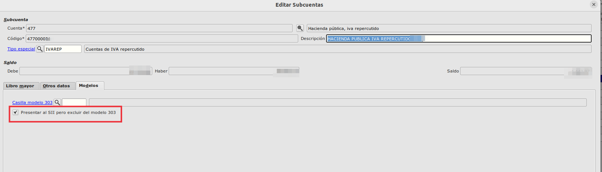

# Configuración IVA

### Excluir subcuentas del Modelo 303 pero no de presentaciones del SII

Para excluir aquellas partidas que no queramos que se presenten en el modelo 303 pero que si queramos que se presenten en el SII, lo que haremos es ir a la subcuenta correspondiente y marcar el check habilitado para ello.

Iremos **Área Financiera -> Principal -> Subcuentas**,  editaremos la subcuenta la cual no queramos presentar en el modelo 303 y en la pestaña de **Modelos** marcaremos el check *Presentar al SII pero excluir del modelo 303*

 

 ### Más
 
   * [Volver al índice](./index.md)
