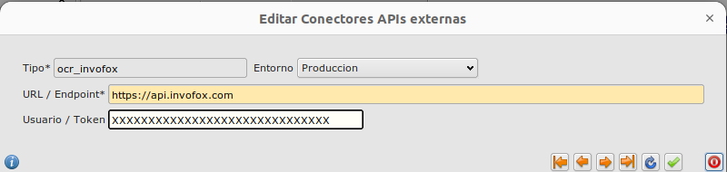
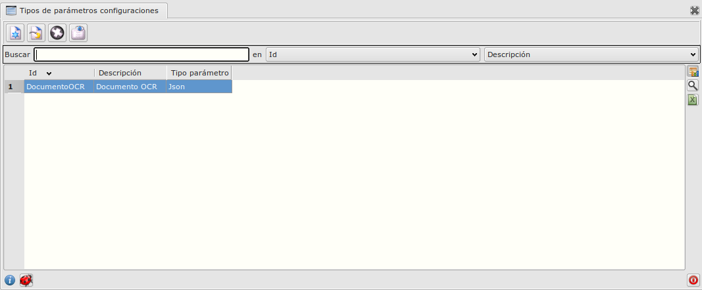
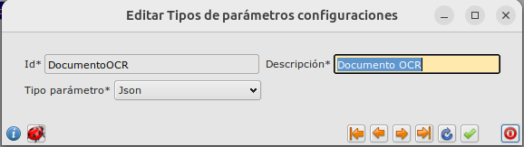
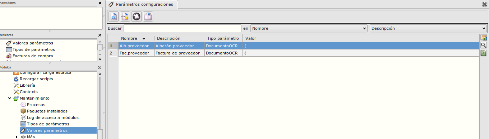
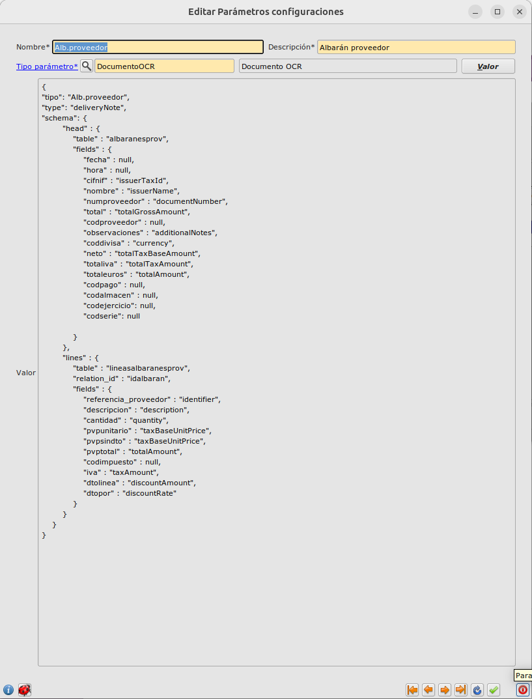
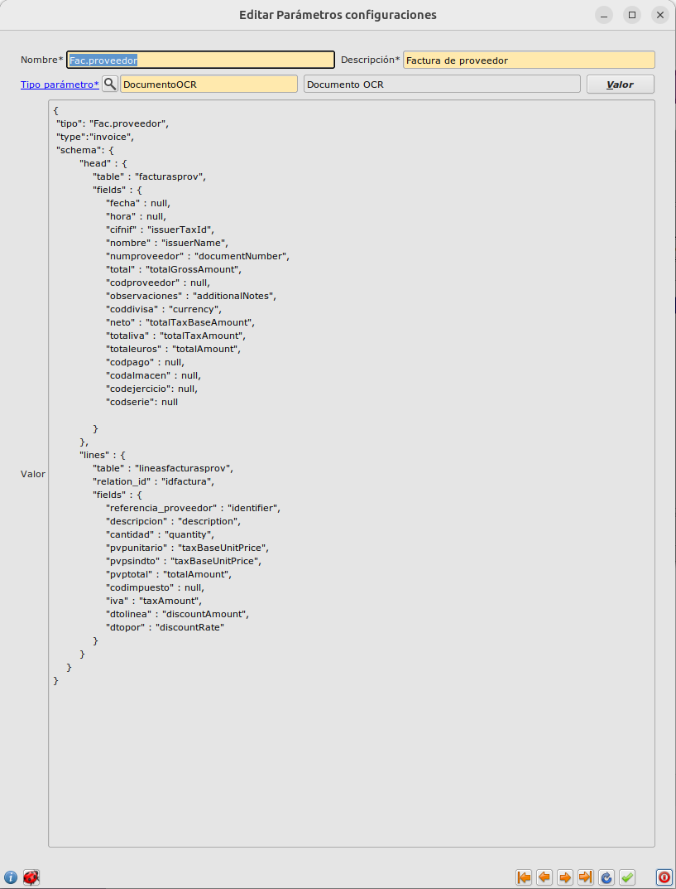

# Configuración OCR

## Datos de conexión

En **_Area de Facturación/principal/Más/Tablas Generales/Conectores_** especificamos la conexión (url y token) facilitada por Yeboyebo.
La url es siempre https://api.invofox.com


## Esquemas de datos

En **_Area de Sistema/Mantenimientos/Tipos de parámetros_** creamos un tipo llamado DocumentoOCR




En **_Area de Sistema/Mantenimientos/Valores parámetros_** hay que rellenar los esquemas de los albaranes y facturas de proveedor, especificando el tipo DocumentoOCR.



```json
{
    "tipo": "Alb.proveedor",
    "type": "deliveryNote",
    "schema": {
        "head": {
            "table": "albaranesprov",
            "fields": {
                "fecha": null,
                "hora": null,
                "cifnif": "issuerTaxId",
                "nombre": "issuerName",
                "numproveedor": "documentNumber",
                "total": "totalGrossAmount",
                "codproveedor": null,
                "observaciones": "additionalNotes",
                "coddivisa": "currency",
                "neto": "totalTaxBaseAmount",
                "totaliva": "totalTaxAmount",
                "totaleuros": "totalAmount",
                "codpago": null,
                "codalmacen": null,
                "codejercicio": null,
                "codserie": null,
                "codgrupoivaneg": null
            }
        },
        "lines": {
            "table": "lineasalbaranesprov",
            "relation_id": "idalbaran",
            "fields" : {
                "referencia_proveedor" : null,
                "referenciaproveedor": "identifier",
                "descripcion": "description",
                "cantidad": "quantity",
                "pvpunitario": "taxBaseUnitPrice",
                "pvpsindto": "taxBaseUnitPrice",
                "pvptotal": "totalAmount",
                "codimpuesto": null,
                "iva": "taxAmount",
                "dtolinea": "discountAmount",
                "dtopor": "discountRate"
            }
        }
    }
}
```


```json
{
    "tipo": "Fac.proveedor",
    "type": "invoice",
    "schema": {
        "head": {
            "table": "facturasprov",
            "fields": {
                "fecha": null,
                "hora": null,
                "cifnif": "issuerTaxId",
                "nombre": "issuerName",
                "numproveedor": "documentNumber",
                "total": "totalGrossAmount",
                "codproveedor": null,
                "observaciones": "additionalNotes",
                "coddivisa": "currency",
                "neto": "totalTaxBaseAmount",
                "totaliva": "totalTaxAmount",
                "totaleuros": "totalAmount",
                "codpago": null,
                "codalmacen": null,
                "codejercicio": null,
                "codserie": null,
                "codgrupoivaneg": null
            }
        },
        "lines": {
            "table": "lineasfacturasprov",
            "relation_id": "idfactura",
            "fields" : {
                "referencia_proveedor" : null,
                "referenciaproveedor": "identifier",
                "descripcion": "description",
                "cantidad": "quantity",
                "pvpunitario": "taxBaseUnitPrice",
                "pvpsindto": "taxBaseUnitPrice",
                "pvptotal": "totalAmount",
                "codimpuesto": null,
                "iva": "taxAmount",
                "dtolinea": "discountAmount",
                "dtopor": "discountRate"
            }
        }
    }
}
```

### Más

- [Volver al índice](./index.md)
