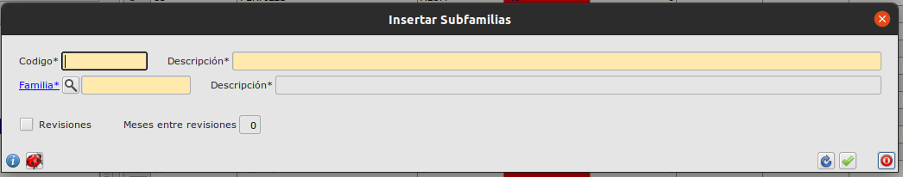
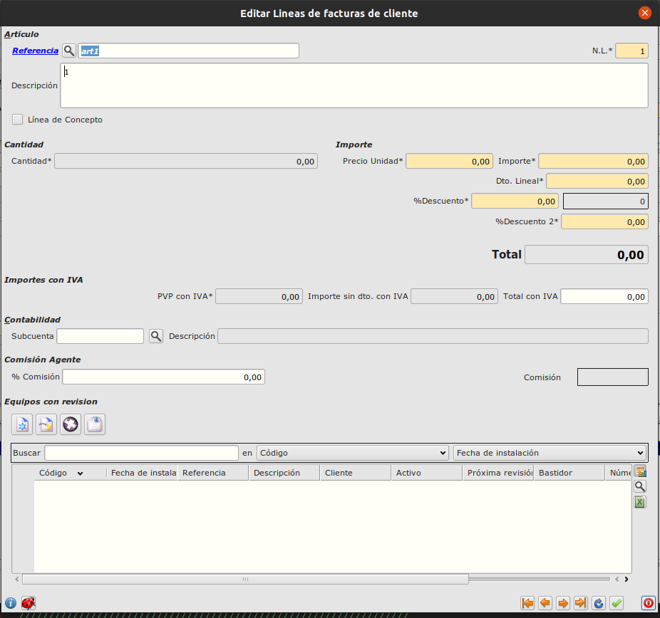
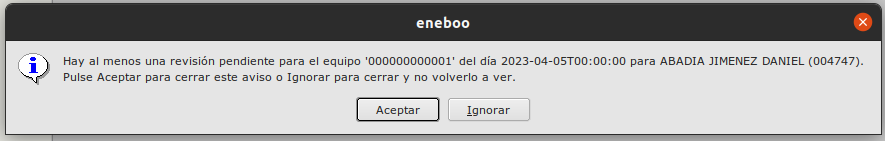

# Equipos con revisión

La tabla de equipos con revisión nos permite tener un control de las revisiones que se realizan periódicamente a ciertos equipos vendidos.

## Cómo crear equipos revisables periódicamente

Para crear equipos revisables debemos seguir los siguientes pasos:

- Crear una subfamilia que tenga el check de 'revisiones' marcado y con una cantidad de meses entre revisiones mayor que 0. Ruta: **Área de facturación -> Almacén -> Subfamilias**

- Crear un artículo que pertenezca a una subfamilia con las características anteriores. Ruta: **Área de facturación -> Almacén -> Artículos**
- Añadir en una línea de factura de venta la referencia del artículo anterior.
    - El campo cantidad del formulario se deshabilitará. Para añadir cantidad tendremos que insertar registros en la tabla de equipos con revisión asociada a la línea de factura.

- Por cada registro de equipos con revisión que queramos crear, tendremos que añadir un registro en la tabla de equipos del formulario de líneas de factura e introducir los datos necesarios a mano.
    - El equipo se creará con una fecha calculada para su primera revisión en función del número de meses entre revisiones que venga especificado en la subfamilia. Pero sigue siendo modificable.

## Sistema de avisos

Si se pasa la fecha de la próxima revisión de un equipo, saltará un mensaje cuando intentemos acceder a cualquier módulo del área de facturación.

En el caso de que haya varios equipos con revisiones pendientes, saldrá un mensaje por cada equipo.

[Volver al Índice](../index.md)
