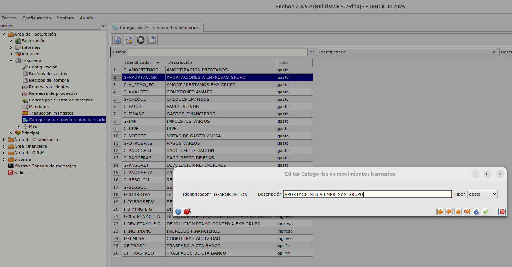
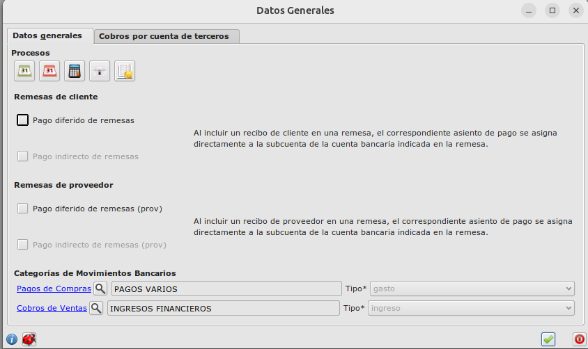
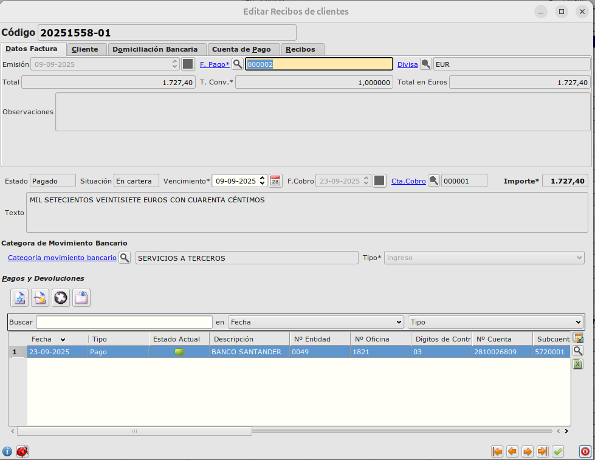
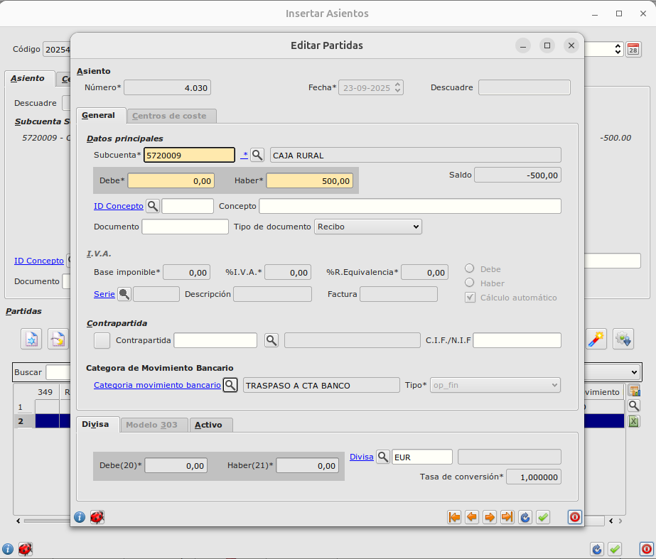
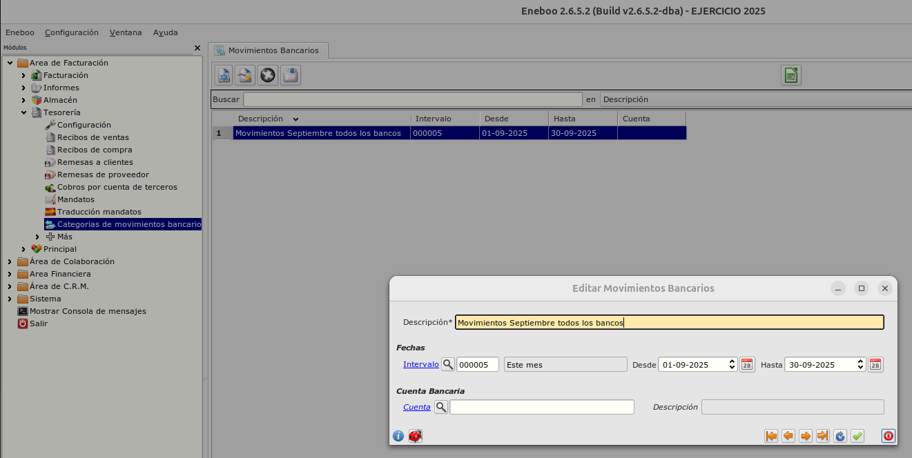
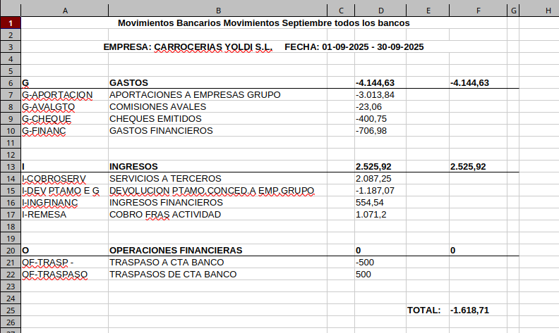

# Informe de Tesorería

Inforem en formato hoja de cálculo que agrupa entradas y salidas en cuentas de banco y caja en categorías agrupadas en ingresos, gastos y operaciones financieras

## Cómo crear y mantener categorías de movimiento bancario

Para crear y mantener categorías de movimientos bancarios debemos seguir los siguientes pasos:

- Accedemos a **Área de facturación -> Tesorería -> Categorías de Movimientos Bancarios**
- Crearemos todas las categorías necesarias estableciendo **Código**,**Descripción** y **Tipo**: _ingreso,gasto, op_fin (operaciones financieras)_

## Cómo configurar las categorías para recibos de compra y venta

### Configuración de categorías por defecto

Establecereomos dos valores por defecto para recibos. Para ello, en el apartado de configuración del módulo de Tesorería: **Área de facturación -> Tesorería -> Cpmfogiración**, tenemos dos campos nuevos:

- Categoría de movimiento bancario para **Cobros de Ventas**
- Categoría de movimiento bancario para **Pagos de Compras**

Una vez informados esos campos, en recibos de cliente y proveedor, ese mismo valor se informará de forma automática con los valores de la configuración

### Modificación de categoría en recibos

Opcionalmente para recibos en estado emitido será posible modificar la categoría del movimiento.

## Asientos manuales

También es posible informar manualmente la cateforía de movimiento bancario en asientos en estado Editable

## Cómo usar el informe de movimientos bancarios de tesorería

Accedemos al informe desde **Área de facturación -> Informes -> Movimientos Bancarios**

- Crearemos un registro estableciendo el intervalo de fechas y opcionalmente la cuenta bancaria.

- En el formulario principal pulsamos el botón de generar informe con formato Hoja de Cálculo. Se creará y abrirá un fichero mostrando los datos agrupados por tipo de categoría y categoría.

[Volver al Índice](../index.md)
