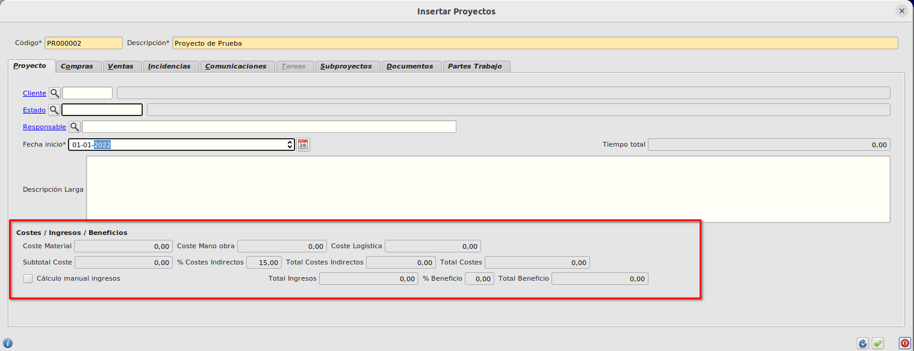
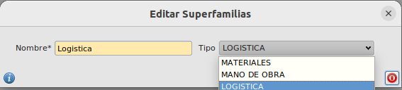
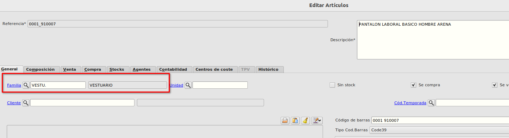
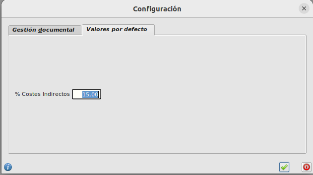

# Configuración

Para la correcta asignación de gastos e ingresos a los proyectos tenemos que realizar una serie de configuraciones.

Si vamos a la pestaña de *Proyecto* del formulario de *Proyectos* que podemos encontrar en **Área de Colaboración -> Proyectos -> Proyectos** podemos ver el desglose de costes e ingresos 

## Asociación de tipo de coste a Artículos

Los costes de los proyectos se dividen en:
- Coste Material
- Coste Mano Obra
- Coste Logística

Estos tipos de coste se asocian a *Superfamilias*

Las superfamilias se asocian a *Familias*

Las *Familias* se asocian a *Artículos*

La forma de calcular cada coste será a partir de las líneas de albaranes/facturas de compras las cuales tienen asociadas una referencia y con la relación que hemos definido de **Referencia -> Familia -> Superfamilia -> Tipo de coste** automáticamente el sistema sabe como calcular el coste y en que campo del proyecto se informará. 

Las superfamilias las podemos encontrar en el **Área de facturación -> Almaćen - Superfamilias**

Las familias las podemos encontrar en el **Área de facturación -> Almaćen - Familias**

Los artículos los podemos encontrar en **Área de facturación -> Almaćen - Artículos**

## % Costes indirectos
Vamos al **Área de Colaboración -> Proyectos -> Configuración** y en la pestaña de valores por defecto informaremos el campo *% Costes indirectos* el cual se utilizará para calcular el importe de costes indirectos del proyecto.

