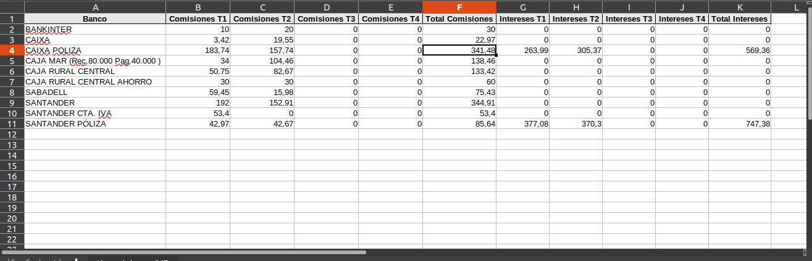

# Obtener informe de bancos por trimestre.

### Objetivo

* Podremos obtener un registro con los importes de comisiones e intereses de cada subcuenta de bancos para el año indicado.

## Configuración de subcuentas de comisiones e intereses.

* Entramos en la opción **Area financiera -> Modelos -> Configuración**, vamos a la pestaña Studio17 e informamos las subcuentas sobre las que queremos buscar comisiones e intereses.
* Podemos informarlas como en la captura de pantalla con el formato **Cuenta . numero (6653.1)** donde se sustituiran el punto por los ceros correspondientes.

## Proceso

* Entramos en la opción **Area financiera -> Modelos -> Bancos 347** y creamos un nuevo registro. Informamos el año y pulsamos sobre el botón de **Calcular Datos**.

* Una vez terminado el proceso nos aparecerá una línea para cada banco con sus columnas correspondientes de comisiones e intereses. En la cabecera tendremos el total de bancos obtenidos y la suma total de comisiones y la de intereses.

* Podremos exportar la tabla de líneas a excel con el botón a la derecha de la tabla con una X verde.

