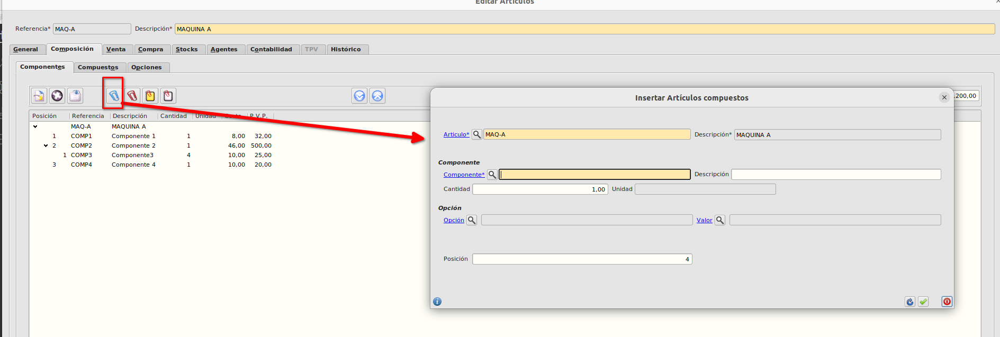

# Árbol de componentes

* Dentro del formulario de artículos, el cual podemos encontrar en **Área de facturación -> Almacén -> Artículos**, tenemos la pestaña **Composición** desde la cual gestionaremos los componentes que tiene una determinada máquina.

* Se pueden asociar tantos componentes como se deseen y anidar componentes uno dentro de otro.
* Si pulsamos en el botón *Asociar componente* (clip azul) se mostrará el formulario para asociar al artículo compuesto el componente.

* Informamos el campo *Componente* con el componente que queremos asociar, las unidades del componente necesarias para el compuesto (por defecto 1, en nuestro ejemplo hemos puesto 2 unidades) y la posición que queremos que tenga dentro de la composición, por defecto ofrece la siguiente posición a la última introducida. 

* Al aceptar el formulario se muestra en el árbol el nuevo componente, mostrando la cantidad que hacen falta para el compuesto, el coste y el pvp del componente.

* Podemos subir o bajar el componente cambiándose la posición automáticamente con los botones de subir/bajar.

* En la ficha del artículo se actualizará el campo *Coste componente* como la suma de los costes totales de los componentes. 

* Para eliminar un componente de una artículo, seleccionaremos el componente en el árbol y pulsaremos sobre el clip rojo.