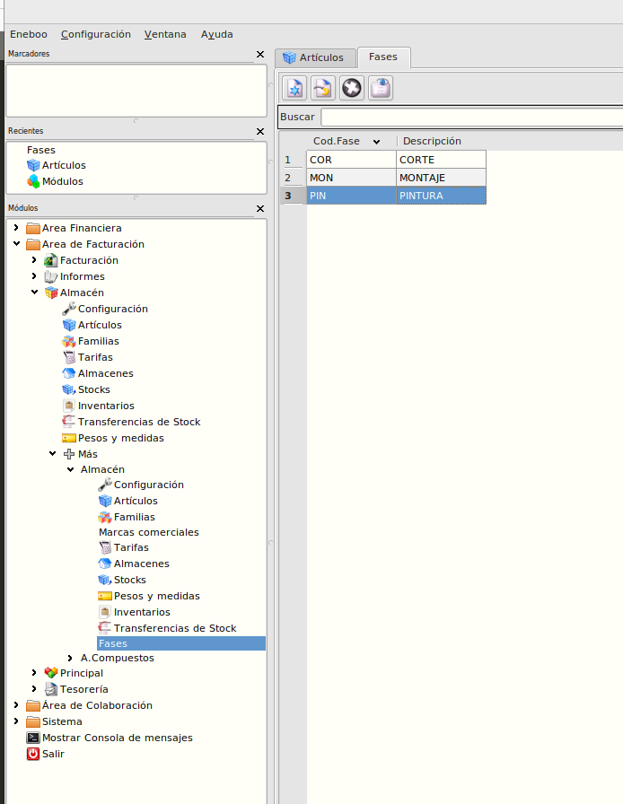
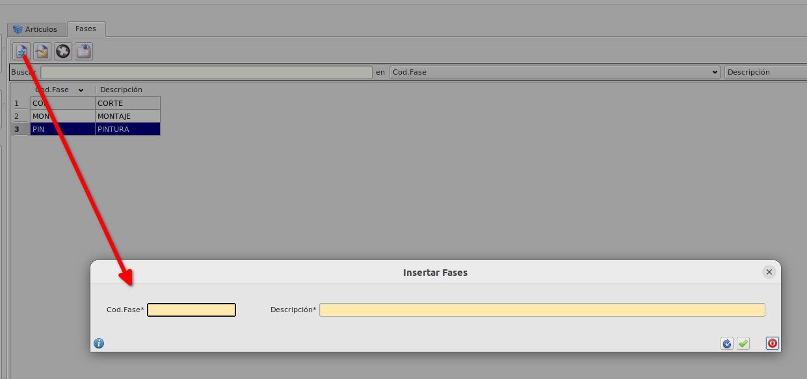
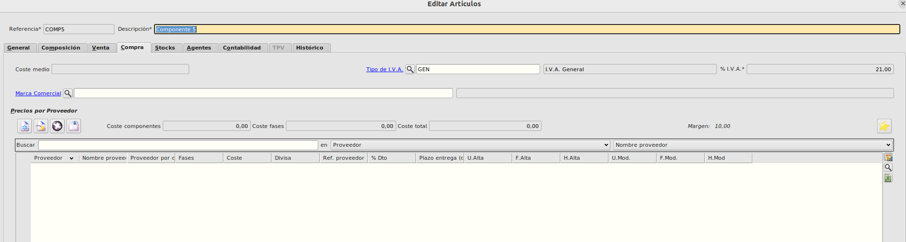
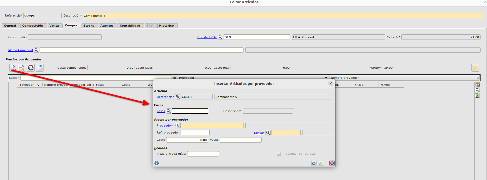
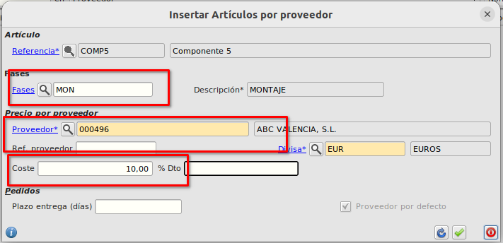
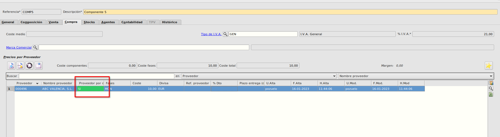
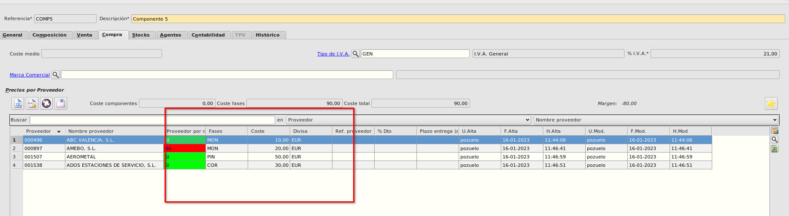
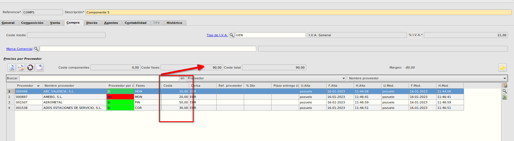

# Proveedores por fase

## Fases
* En el **Área de facturación -> Almacén -> Más -> Almacén -> Más** podemos ver las fases en las que nos puede dar servicio un determinado proveedor

## Proveedores por fase

* En la pestaña de **Compra** de la ficha de artículos podemos informar los distintos proveedores a los que comprar un determinado artículo así como el precio al que le compramos a cada proveedor, referencia del proveedor etc. pudiéndo asociar la *Fase* y marcar un proveedor por defecto por fase.

* Pulsamos en añadir nuevo precio por proveedor y se nos muestra el formulario para asociar un nuevo proveedor al artículo.

* Informaremos la *Fase*, el *Proveedor* y el *Coste*.

* Al aceptar, si solo existe un proveedor para esta fase y artículo, se marcará como *Por defecto* automáticamente, si ya existe algún proveedor para esta fase asociado a la referencia no se marcará por defecto

* Podremos tener tantos proveedores por fase y artículo como queramos pero sólamente podrá haber un proveedor por defecto por fase.

* En la ficha del artículo se calculará el campo *Coste fases* como la suma de los costes de los proveedores marcados por defecto.

