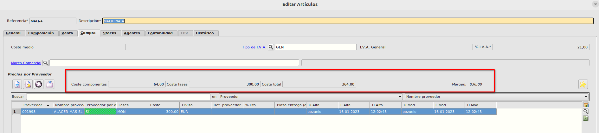

# Cálculo de costes
* Dentro de la ficha del artículo, en la pestaña de **Compras** tenemos los siguientes campos:
    - Coste componentes: Se calcula como la suma de los costes totales de los componentes.
    - Coste fases: Se calcula como la suma de los costes de los proveedores por defecto del artículo.
    - Coste total: Este es el coste del artículo que se calcula como la suma del coste componentes y el coste fases.
    - Margen: Es la diferencia entre el pvp de del artículo y el coste total.

