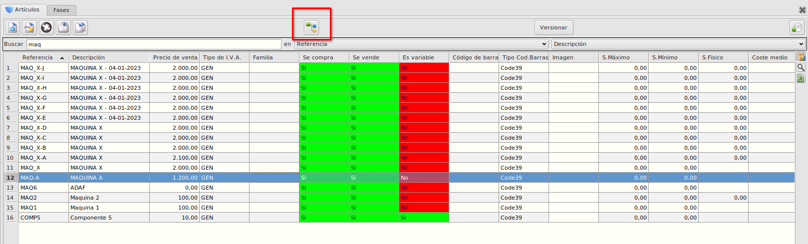
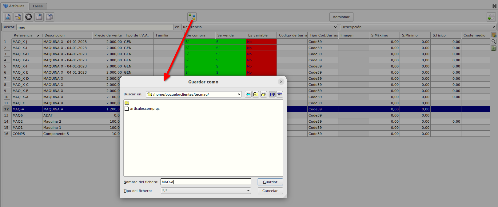
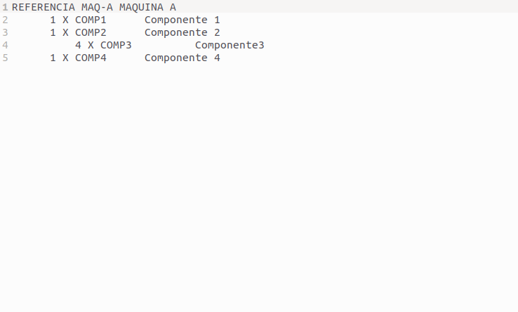

# Informe de composición
* Desde el maestro de artículos podemos imprimir el informe de composición de una determinada máquina.

* Teniendo seleccionado la máquina pulsaremos sobre el botón **Informe de composición** y nos pedirá que seleccionamos la ruta donde queremos guardarlo.

* Cuando aceptemos se creará un fichero de texto mostrando en orden los componentes de la máquina.

