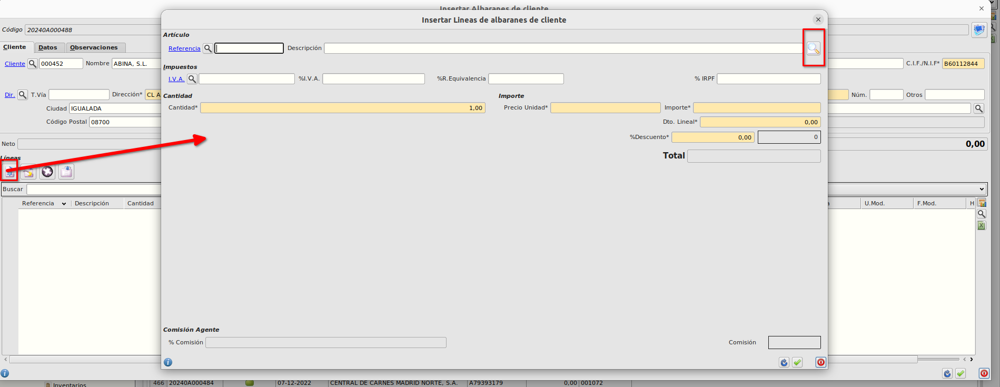
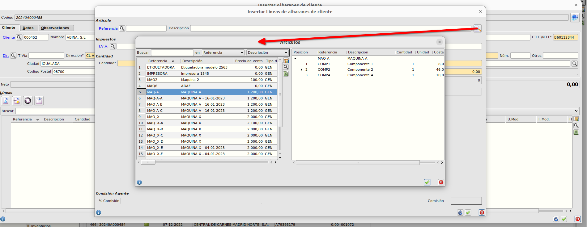
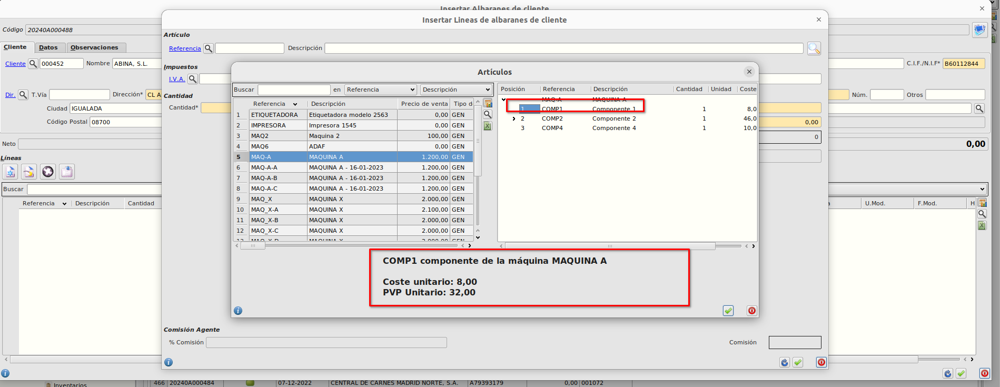
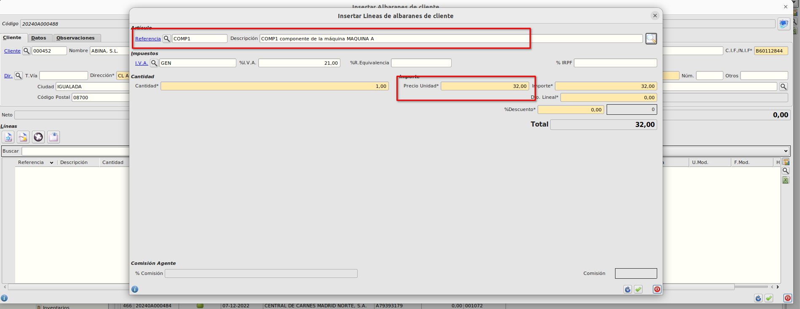

# Selección de componente de un compuesto en líneas de albaranes de venta

* Cuando estamos creando una línea de albarán, tenemos la posibilidad de añadir la referencia a vender seleccionando una máquina y luego el componente de forma sencilla pulsando sobre el botón de la lupa.

* Cuando pulsemos sobre la lupa se mostrará un formulario en el cual podemos ver en la parte izquierda todas las referencias que tienen asignadas algún componente y en la parte derecha los componentes de la referencia que tengamos seleccionada en la parte izquierda.

* Seleccionando un componente en la parte derecha se muestra el coste unitario y el pvp unitario de ese componente así como la descripción.

* Al aceptar se informará en la línea del albarán la referencia componente seleccionada, el pvp que tenga en su ficha y como descripción se pondrá el *código del componente* seguido de *componente de la máquina* y seguido de la *referencia de la máquina seleccionada*

