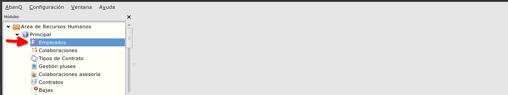
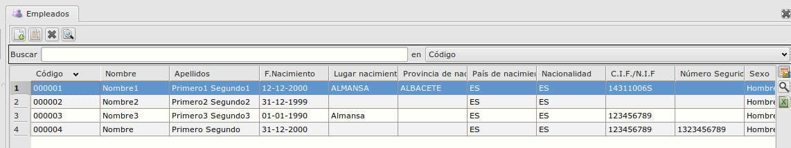
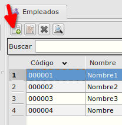
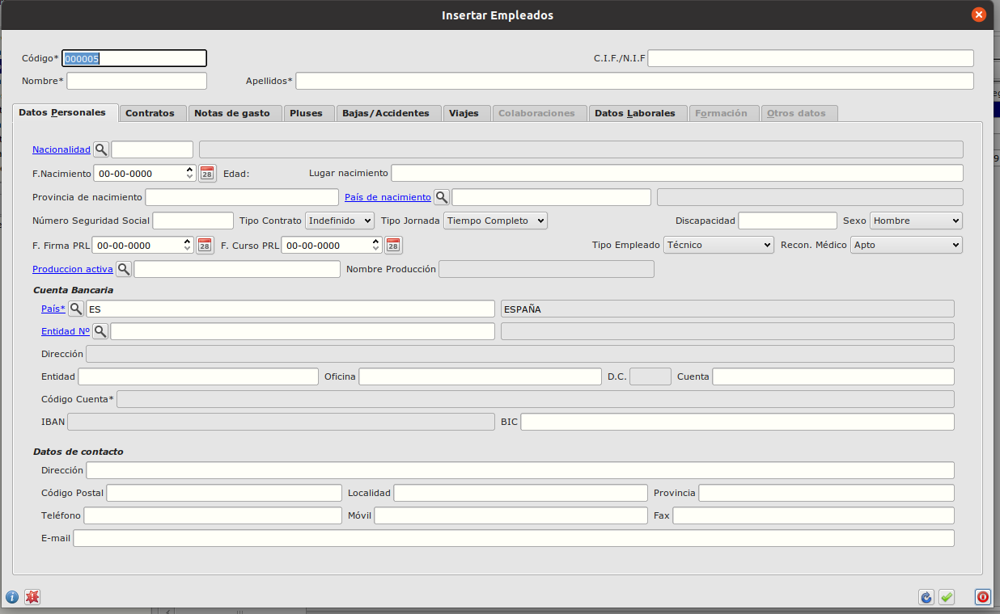
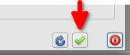
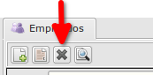

# Empleados
---------------------------
Primero iniciamos la tabla con los empleados desde Área de Recursos Humanos -> Modulo Principal -> Gestión de pluses.

  

Con doble click se habre la ventana de los empleados.
Desde aqui podemos gestionar los empleados (crear, actualizar o eliminar empleado).

  

Para crear un empleado usemos el botón + , situado en la parte de arriba de la ventana:

  

Se abre el formulario de empleado con varias pestañas.

  

Desde aqui se rellenan los datos del empleado y al guardar se usa el botón verde de abajo 
    o se usa la tecla F10 desde el teclado.

Para eliminar un registro de la tabla empleados usamos el botón 'X'  o la tecla 'Supr' del teclado.

## Más

  * [Volver al índice de modulo principal](../flrrhhppal.md)