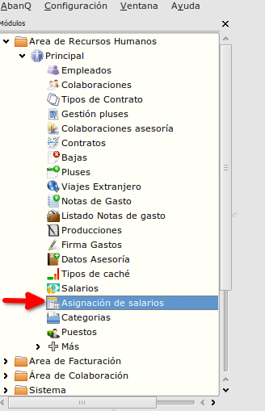
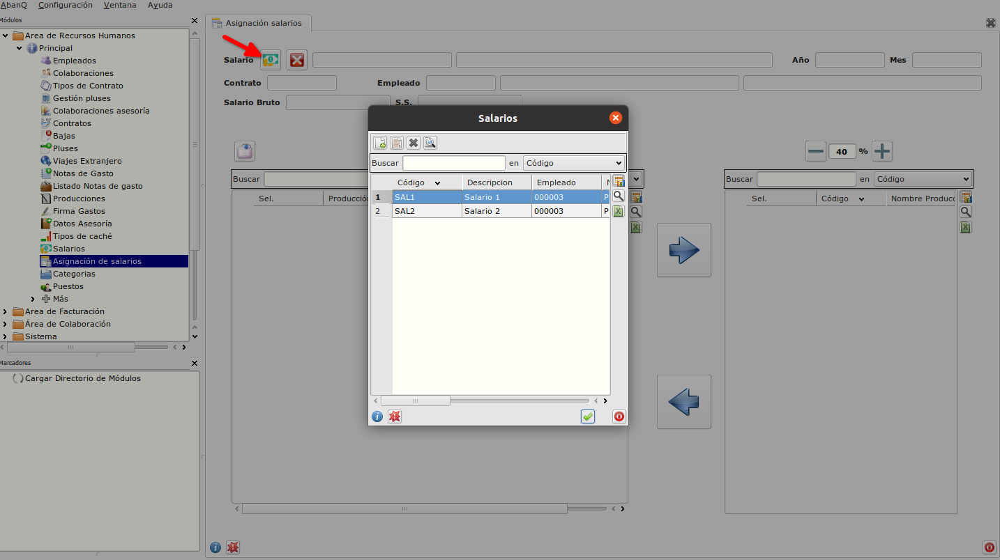
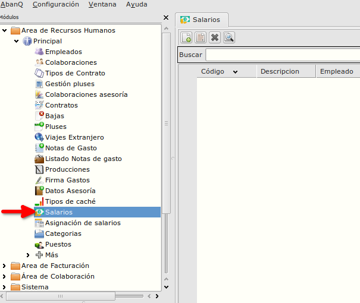
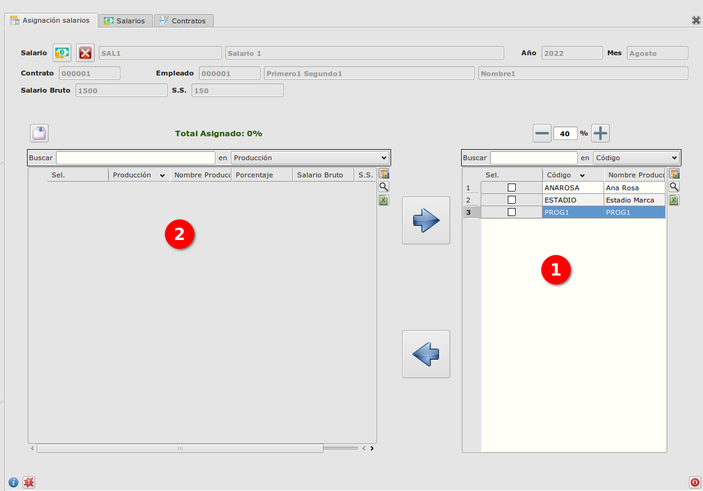

# Asignación salarios
---------------------------
### Objetivo

   La funcionalidad esta creada para asignar salarios de los empleados.

### Proceso

  La ventana de Asignación de salarios se inicia desde Área de Recursos Humanos -> Modulo Principal -> Asignación de salarios.

  

  En la parte de arriba de la ventana podemos observar que hay un botón para seleccionar el salario deseado.  

  

  Si no hay ningún salario creado, podemos ir en  

  y crearlo.  
  Una vez seleccionado se cargan los datos del salario  y tambien en la tabla de la izquierda (tabla 1) las producciones en las que se va a asignar el salario.

   

  A seleccionar una producción de la tabla 1, con los botones de arriba (- y +) podemos seleccionar el porcentaje de la producciṕon que se va a asignar al salario y con la flecha a la izquierda añadimos la producción selecionada en la tabla 2. 
  Tambien tenemos posibilidad de desasignar una producción del salrio con la flecha a la derecha. 

## Más

  * [Volver al índice de modulo principal](../flrrhhppal.md)