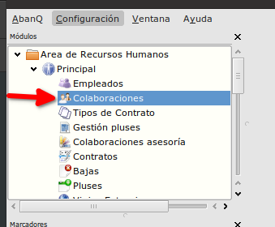
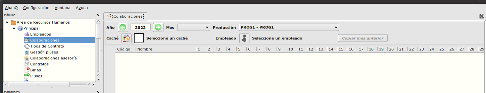
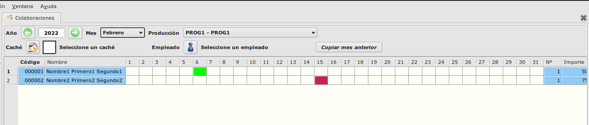

# Colaboraciones
---------------------------
### Objetivo

   La funcionalidad esta creada para optimizar el proceso de crear, modificar y eliminar las colaboraciones de los empleados.

### Proceso

  La ventana de Gestión de colaboraciones se inicia desde Área de Recursos Humanos -> Modulo Principal -> Colaboraciones.

  

  Después de iniciar la ventana podemos observar que hay unos filtros (año, mes, producción, empleado) que se deben informar para que se carga la tabla de los empleados. 

  

  Al informar el año, mes y producción se cargan los datos de los empleados con la producción asociada. Si algún empleado no tiene colaboraciones creados se inserta una fila vacia para que se pueden añadir sus colaboraciones.

  

  Para crear o borrar colaboraciones se usan las columnas de los días del mes.
  * Primero hay que informar el cache de la colaboración.
  * Con el doble click sobre el día se crea la coloboración si no existe o se elimina si existe.
  A parte de las columnas de los días del mes, tenemos algunas mas:
    * Nº - Cantidad total de las colaboraciones del empleado para la producción y mes seleccionado.
    * Importe - Suma de todas las colaboraciones.
    * Ajuste - importe para ajustar el total del mes por empleado y produccíon.
    * Total - El importe total por empleado y producción.

## Más

  * [Volver al índice de modulo principal](../flrrhhppal.md)