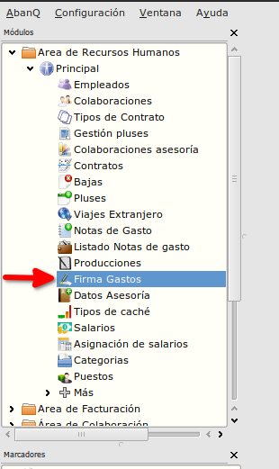
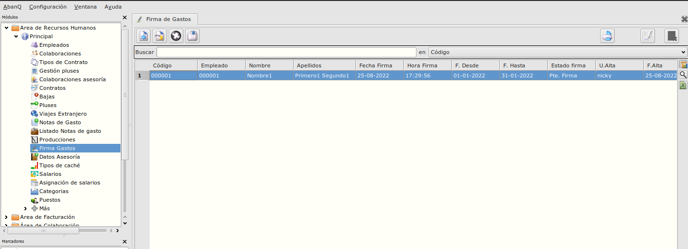
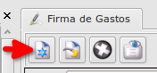
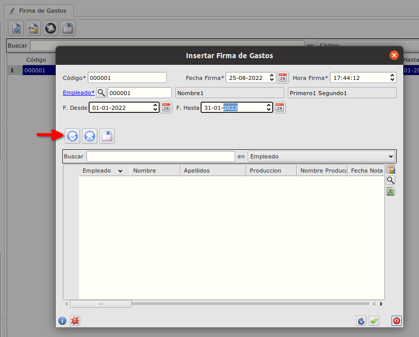
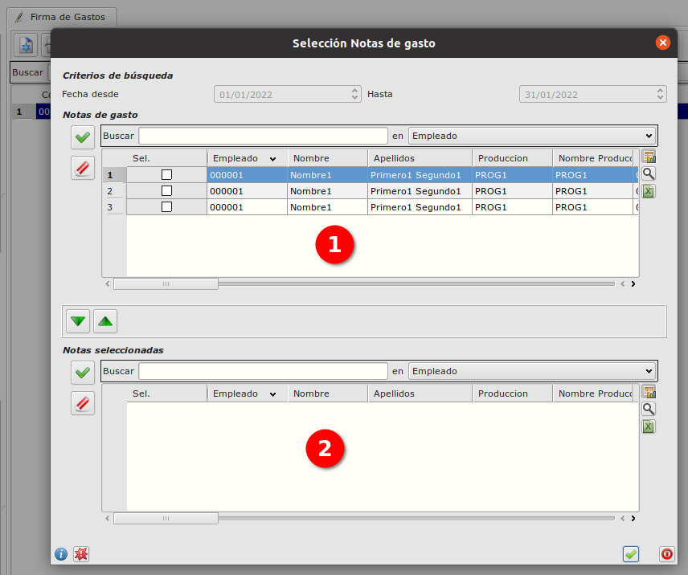
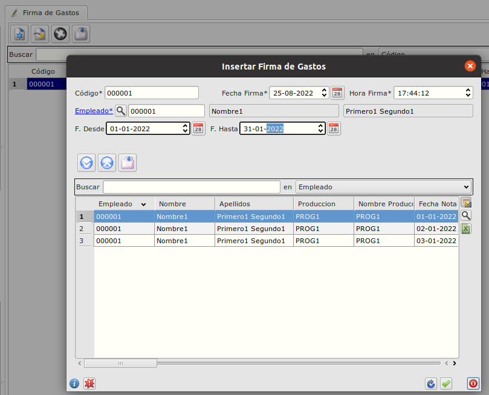
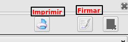

# Firma de Gastos

### Objetivo

   La funcionalidad esta creada para firmar grupo de notas de gasto por empleado.

### Proceso

  La tabla de Firma de Gastos se inicia desde Área de Recursos Humanos -> Modulo Principal -> Firma de Gastos.

  En la tabla se encuentran todos los registros creados para firmar y también los firmados. 

 

  Para crear un nuevo registro de Firma de gastos hay que hacer click sobre el botón.

 

  Se abre el formulario de crear un nuevo registro

 

Primero tenemos que informar los datos obligatorios:
* Empleado
* Intervalo de fechas.
Una vez informados con el bóton marcado abrimos nuevo formulario de selección de gastos filtrado por empleado y intervalo de fechas seleccionado.

 

En la tabla 1 estarán todas las notas de gasto las que podemos seleccionar. Despues de selecionar las que necesitamos con los botones flechas se pueden bajar en la tabla 2. 
Al guardar el formulario ya tenemos preparados las notas de gastos por firmar.

 

Revisemos y si todo esta correcto guardamos el formulario de firmas.  
Estando en la ventana principal al seleccionar un registro podemos firmar, imprimir o borrar firma. Para cada acción tenemos el botón correspondiente.

### Más

  * [Volver al índice de modulo principal](../flrrhhppal.md)