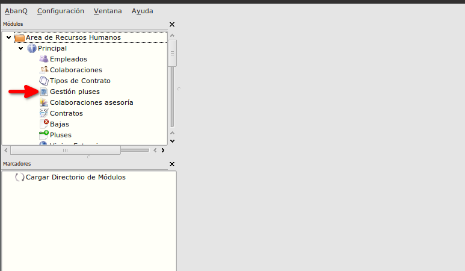
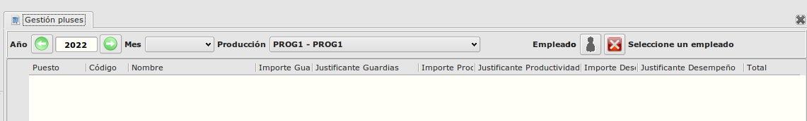
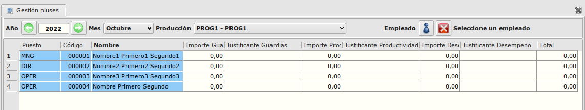

# Gestión pluses

### Objetivo

   La funcionalidad esta creada para optimizar el proceso de crear, modificar y eliminar pluses de los empleados

### Proceso

  La ventana de Gestión de pluses se inicia desde Área de Recursos Humanos -> Modulo Principal -> Gestión de pluses.

  

  Después de iniciar la ventana podemos observar que hay unos filtros (año, mes, producción, empleado) que se deben informar para que se carga la tabla de los empleados. 

  
  Al informar el año, mes y producción se cargan los datos de los empleados con la producción asociada.
  Si no se informa el empleado en la tabla se cargan todos los empleados que tienen asignada la producción informada.

  

  Como observamos la tabla contiene los datos de los empleados y columnas para los importes y justificantes de los tres tipos de pluses (Guardia,Productividad,Desempeño). Con estas columnas se pueden crear, actualizar o eliminar pluses. Para eliminar un registro de pluses solo hace falta poner el importe del tipo plus a 0.
  La última columna es el total de todos los pluses del empleado la que se calcula automáticamente.  

### Más

  * [Volver al índice de modulo principal](../flrrhhppal.md)