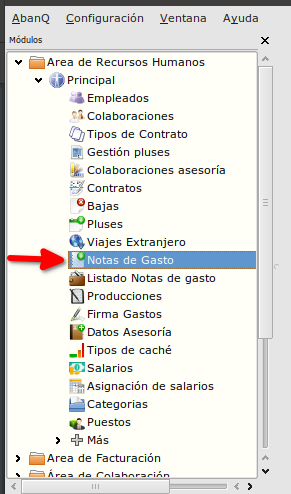
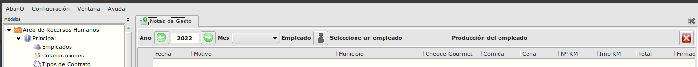
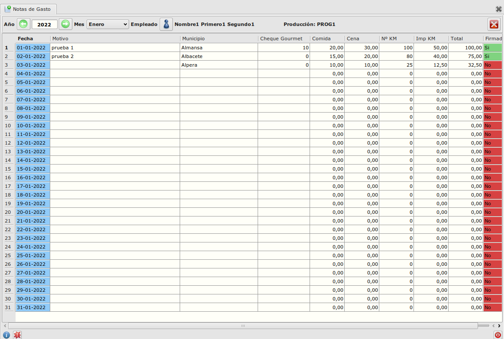

# Notas de Gasto

### Objetivo

   La funcionalidad esta creada para optimizar el proceso de crear, modificar y eliminar las notas de gasto de los empleados

### Proceso

  La ventana de Gestión de Notas de Gasto se inicia desde Área de Recursos Humanos -> Modulo Principal -> Notas de Gasto.

  

  Después de iniciar la ventana podemos observar que hay unos filtros (año, mes y empleado) que se deben informar para que se carga la tabla de las notas de gasto por día. 

  
  Al informar el año, mes y empleado se carga la tabla con los días del mes y algunas columnas mas desde donde se crea la nota de gasto del día seleccionado.

  

  Con la tabla iniciada podemos crear o modificar las notas de gasto para el mes seleccionado.  
  Si una nota ya esta firmada no se puede modificar.

### Más

  * [Volver al índice de modulo principal](../flrrhhppal.md)