# Firma de contratos

La firma de contratos se realiza de forma interactiva a través de una API de terceros.

## Configuración
Para el correcto funcionamiento de la firma de contratos debemos de realizar unas configuraciones previas.

En la pestaña **Temporales y documentos** del formulario de **Configuración** que está en  **Área de Recursos Humanos -> Principal** hay que informar el directorio temporal que se utilizará para guardar temporalmente ficheros.

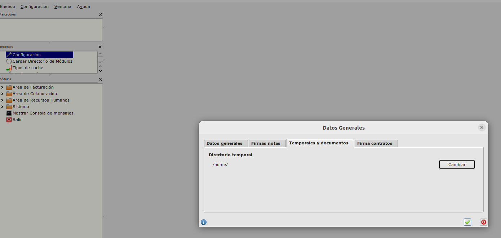

En la **Pestaña de Firma de contratos** del **Área de Recursos Humanos -> Principal -> Configuración** hay que informar los datos que nos ha dado el proveedro de la API.

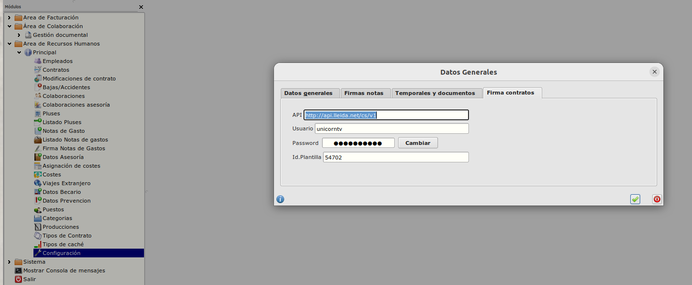

## Prerrequisitos
* Debemos disponer del contrato a firmar en formato PDF
* Para el empleado del contrato, debemos tener informado su email y teléfono en su ficha.

## Envío para firmar
* Vamos a **Recursor Humanos > Principal > Contratos**, seleccionamos el contrato a firmar y pulsamos sobre el botón de *Cargar fichero y comienza proceso de firma*

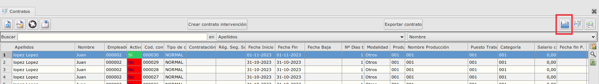

* Seleccionamos el fichero con el documento PDF del contrato.

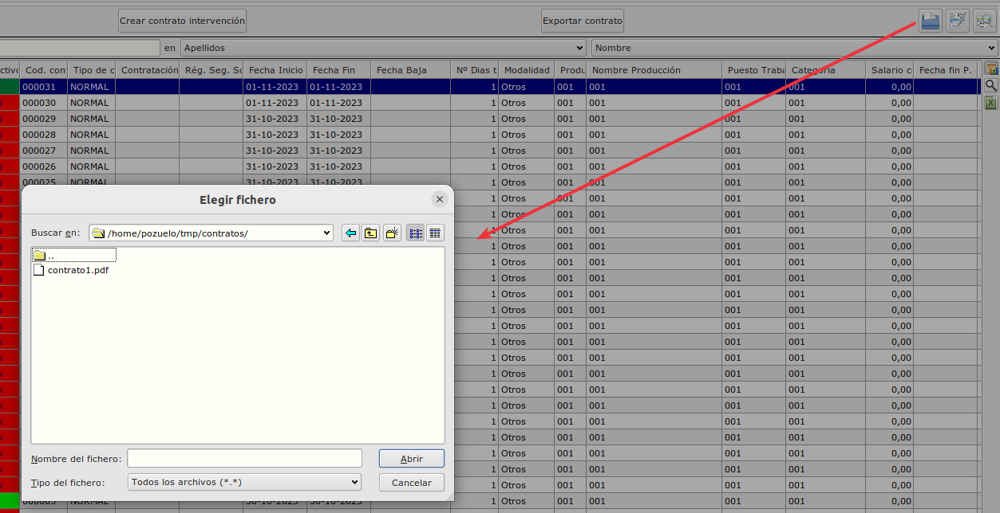

* Automáticamente se lanza el proceso de forma y el campo *Estado de firma* del contrato pasa de estado *Sin Enviar* a *Enviado* y vemos que se ha guardado en el campo *ID. Firma* un identificador de firma.

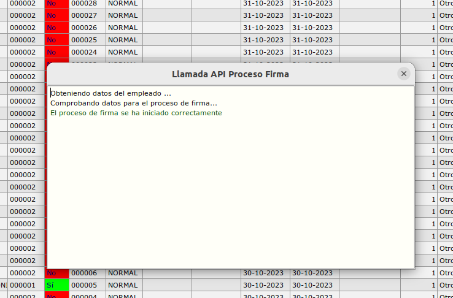

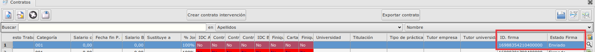

* En este momento se ha enviado el contrato al email que hay informado en la ficha del empleado.

## Firma del contrato por parte del empleado
+ El empleado recibe en su email un correo indicando que tiene un documento para firmar.

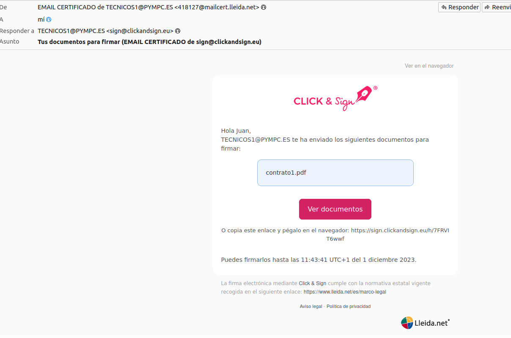

+ Pulsa en el botón de *Ver documentos* o utiliza el enlace adjunto en el correo y sigue las instrucciones para realizarla.

    + Aparece el documento pdf y un botón para firmar

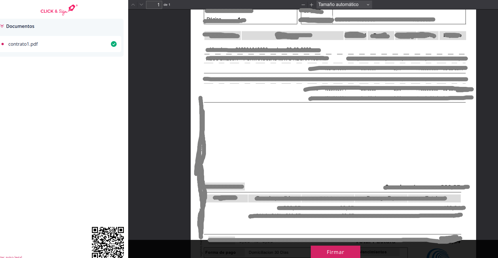

+ El empleado pulsa sobre el botón *Firmar* 

    + Aparece una ventana para poder firmar el documento

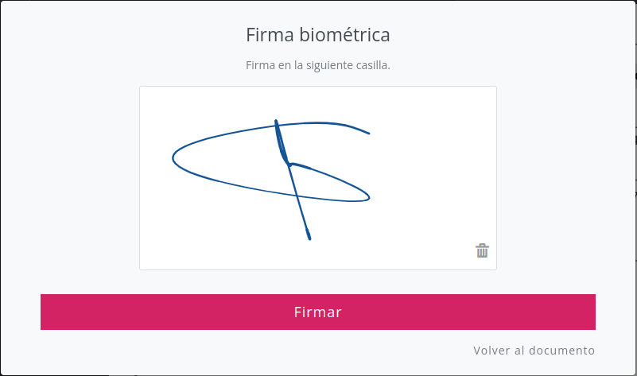

+ Después de realizar la firma, el empleado pulsa en *Firmar*

    + Aparecere un recuadro para introducir el código que le ha llegado a su teléfono móvil.

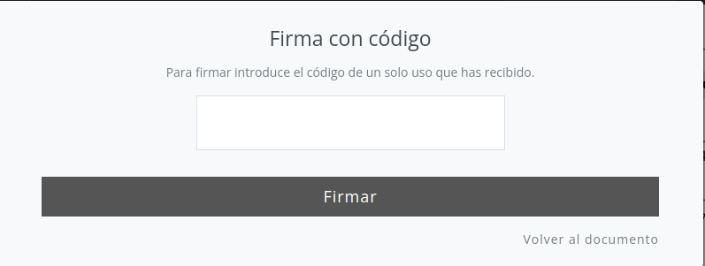

+ El empleado introduce el código y pulsa en firmar

    + El proceso de firma ha terminado.

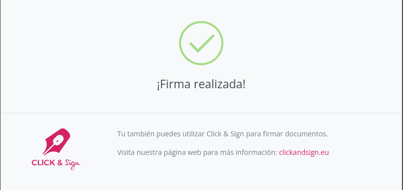

+ El empleado recibirá un correo indicando que se ha firmado el contrato y tendrá 2 ficheros adjuntos, un fichero con el contrato con la firma adjunto y otro fichero que es un certificado con las evidencias electrónicas del proceso de firma.

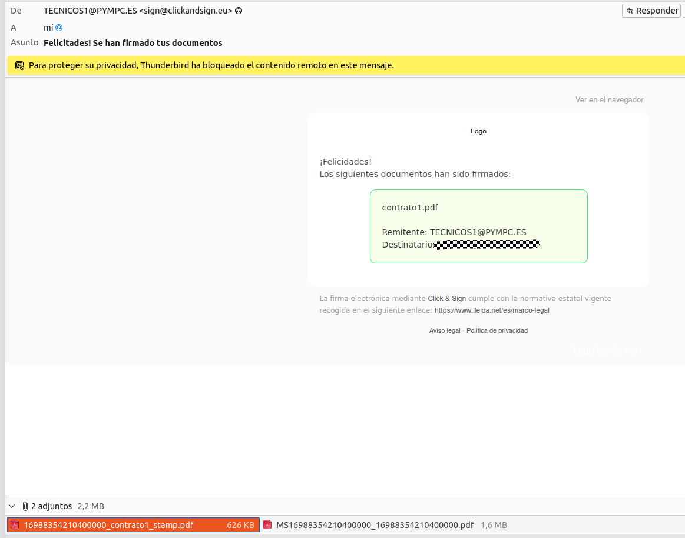

+ El campo *Estado de firma* del contrato pasa de estado *Enviado* a *Firmado*.

## Inicio de la firma de un documento ya asociado al contrato

+ En este caso tenemos un documento asociado al contrato sin firmar.

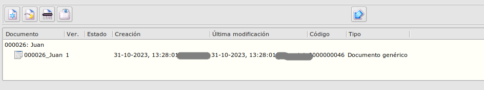

+ Podemos iniciar el proceso con el botón *Comienza proceso de firma*

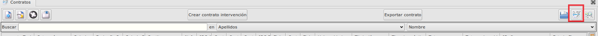

+ El proceso de firma es el mismo que el anterior pero el sistema no pide seleccionar el fichero pdf porque ya está asociado al contrato.

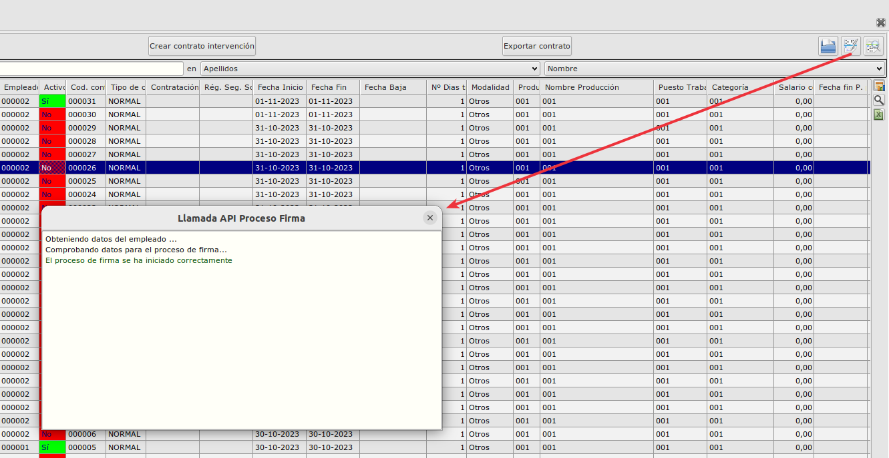

## Actualización del estado de firma
+ Podemos consultar a la API de firma el estado de firma de un contrato con el botón *Comprobar estado de firma*

+ Al pulsar sobre el botón se realizará la consulta y actualizará el campo *Estado firma* con el estado que devuelva la API.

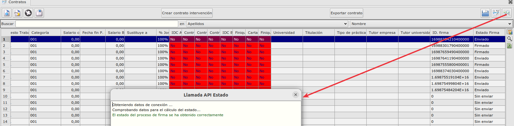

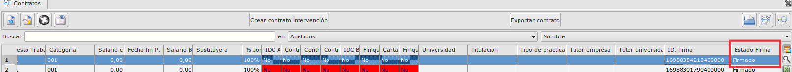

