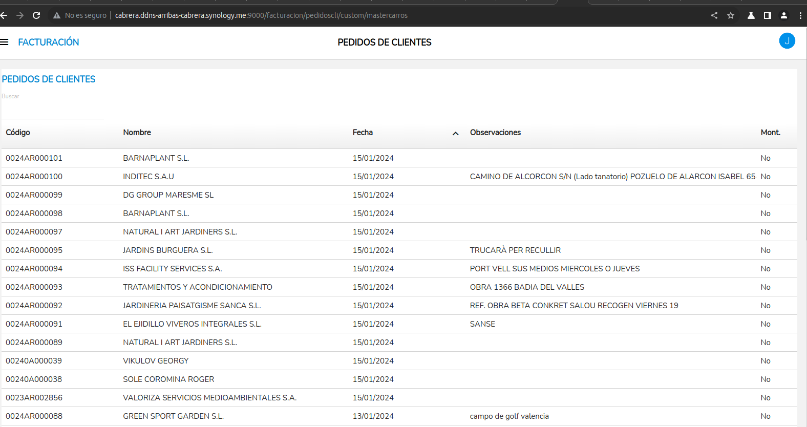
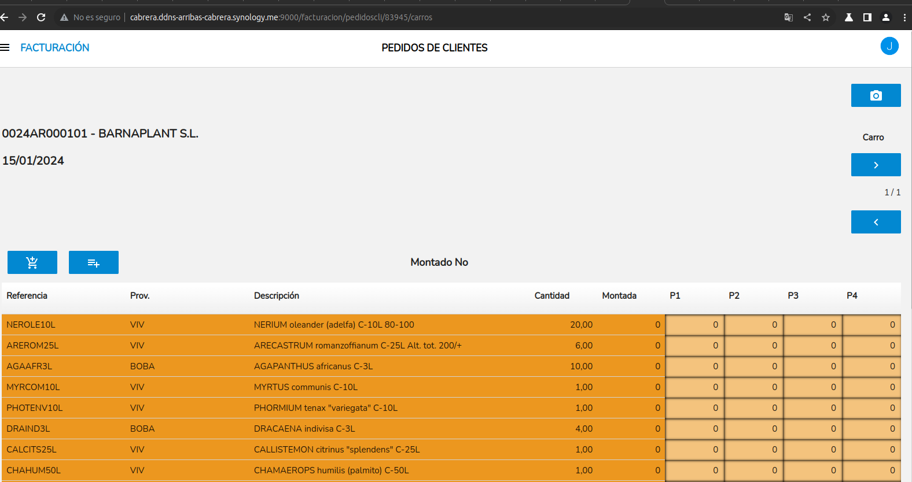

# Carros de pedidos Vbarba

## Master de carros

- Tabla: Pedidoscli
- Filtro: servido in ('No', 'Parcial')
- Orden: fecha Desc, codigo Desc

## Pantalla de carros de pedido

Pantalla sobre un pedido de cliente.

Query tabla lineas:

***

        query = {}
        query["tablesList"] = u"lineaspedidoscli, lineascarro"
        query["select"] = u"lineascarro.idlinea, lineaspedidoscli.aliasprov, lineaspedidoscli.codproveedor, lineascarro.idlineapedido, lineaspedidoscli.cantidad, lineaspedidoscli.cantmontada, lineaspedidoscli.referencia, lineaspedidoscli.descripcion, lineascarro.cantpiso1, lineascarro.numcarro, lineascarro.cantpiso1, lineascarro.cantpiso2, lineascarro.cantpiso3, lineascarro.cantpiso4, lineascarro.cantpiso5, lineascarro.cantpiso6, lineascarro.cantpiso7, lineascarro.cantpiso8, lineascarro.cantpiso9, lineascarro.cantpiso10, lineascarro.cantpiso11, lineascarro.cantpiso12"
        query["from"] = u"lineaspedidoscli LEFT JOIN lineascarro ON lineaspedidoscli.idlinea = lineascarro.idlineapedido"
        query["where"] = u"lineaspedidoscli.idpedido = '" + str(model.idpedido) + "' AND lineascarro.nummontado = '" + str(model.nummontados) + "'"
        query["orderby"] = "lineaspedidoscli.idlinea"
***

Acciones:

### Más

  * [Volver al índice](../index.md)
