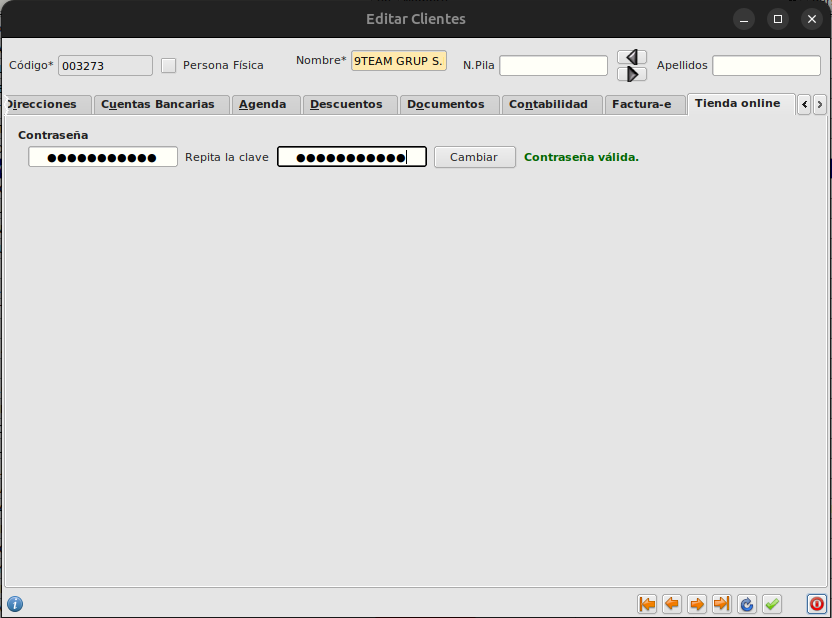

# Configuración tienda online

## Condiciones para usuarios

Los usuarios que acceden a la aplicación se gestionan en el ERP desde Area de ***Facturación->Principal->Clientes***

Un cliente debe tener informado el campo ***E-mail*** para poder logear en la web

Además desde la pestaña ***Tienda online*** del formulario de clientes hay que darles una contraseña, la cual debe tener al menos 6 dígitos, una mayuscula, una minuscula y un número.

* Los clientes de Barnaplant son los mismos de Cabrera y se sincronizaran, sera necesario editar el cliente siempre en Cabrera.

## Condiciones para que artículos sean visibles

Para que un artículo sea visible en la tienda online se deben cumplir las siguientes condiciones:

- Que tengan planta asociada
- Que estén publicados en el último informe de disponibles.

Se mostrarán los precios de los artículos en función de la tarifa del cliente.