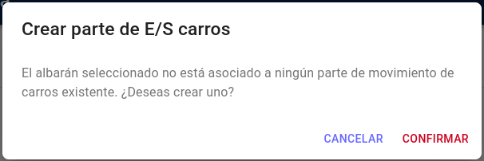
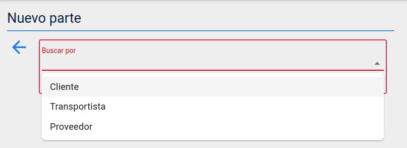
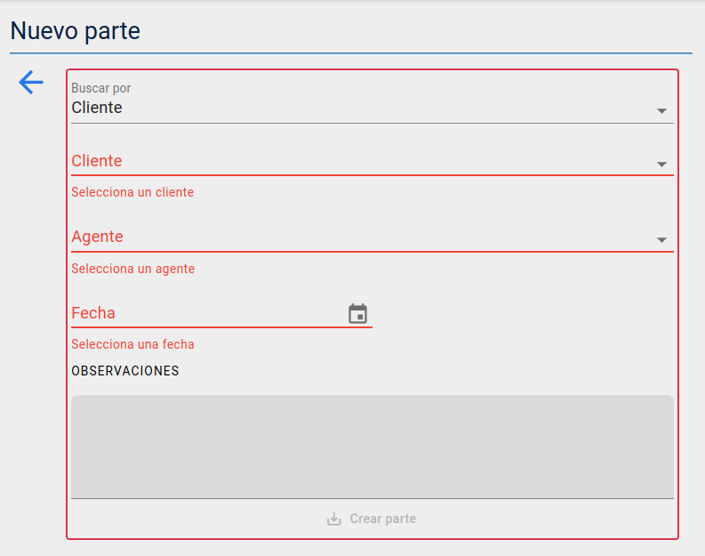
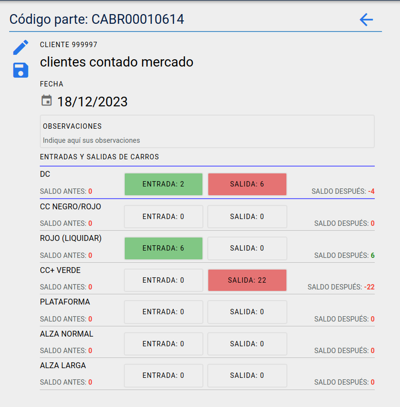
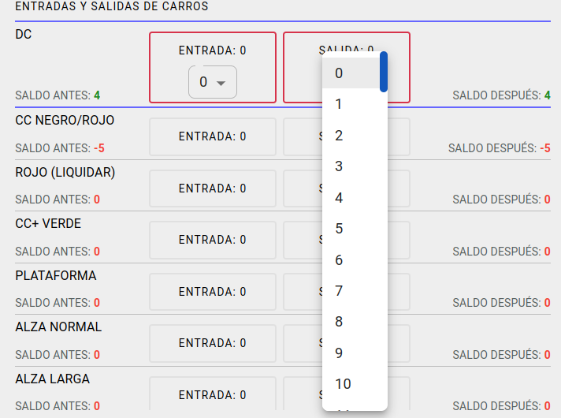

# Firma de partes de carros

Accedemos a la pantalla de listado partes de carros desde la opción **Partes de carros** en el menú **Almacén**.

## Parte de entrada/salida de carros asociado a un albarán

También podemos acceder a un parte asociado con un albarán desde la pantalla **Firmar** en el menú **Albaranes** y clicando en el botón **E/S carros** del albrán deseado. Si no existiera un parte de entrada/salida de carros asociado al mismo, un mensaje emergente dará la posibilidad de crearlo y si comfirmamos la acción, se creara el parte asociado y navegaremos automáticamente a la pantalla del parte de carros.   

## Listado de partes

* Veremos un listado de partes de entrada/salida de carros ordenado por fecha desde la más reciente.

* A la izquierda se encuentra la barra de botones, en la que encontramos un botón para crear un nuevo parte y otro para aplicar filtros a la búsqueda del listado(*código, nombre cliente y fecha*).

* Cada parte consta de la siguiente información:
  * Avatar (círculo de color verde/firmado y rojo/pendiente de firmar)
  * Título izquierdo: Nombre del cliente, transportista o proveedor
  * Subtítulo izquierdo: Código cliente, transportista o proveedor
  * Título derecha: Código del parte
  * Subtítulo derecha: Fecha del parte

* Al clicar en un parte podremos ver la información del mismo a sí como editarla si este no estuviera firmado.

## Crear nuevo parte

* Para la creación de un parte debemos comnezar por seleccionar el tipo de asociación que tendrá el mismo(*cliente, transportista o proveedor*).

* Al seleccionar un tipo se desplegarán los campos necesarios para crear el parte:
  * Selector de cliente, transportista o proveedor.
  * Si el usuario tiene asociado un agente por defecto, este aparecerá seleccionado automaticamente pero también podemos seleccionar otro dentro de la lista.
  * La fecha será automaticamente la del dia actual y el usuario podrá modificarla si así lo desea.
  * Todos los campos son obligatorios salvo las observaciones que son opcionales.

## Editar y firmar un parte

* A la izquierda se encuentra la barra de botones, en la que encontramos
  * Botón para firmar el parte y guardar las entradas y salidas de carros.
  * Botón para guardar las entradas y salidas de carros sin firmar el parte.

* Cada parte consta de la siguiente información:
  * Datos del cliente, transportista o proveedor.
  * Fecha del parte.
  * Observaciones.
  * Editor de entradas y salidas de carros.
    * Las entradas positivas se destacarán con el fondo verde y las salidas con el fondo rojo.
    * Los saldos positivos se destacarán con el número en verde y los negativos con el número rojo.

  

### Editar entradas y salidas de carros
  Para editar tanto las entradas como las salidas, clicamos en el campo y se desplegará un selector con el qie podemos seleccionar la cantidad de carros(0/100).

  

  La edición se perderá si los datos no se guardan clicando el botón *Guardar las entradas/salidas* o firmando el parte.