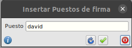
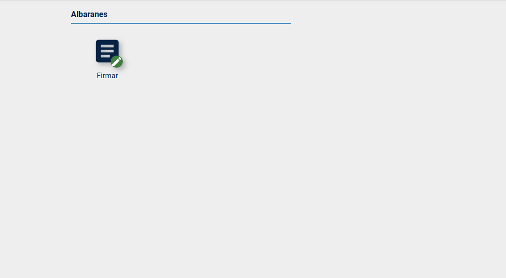
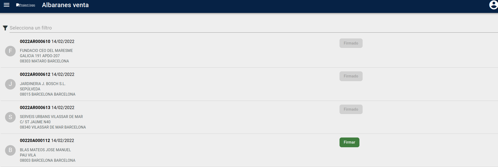
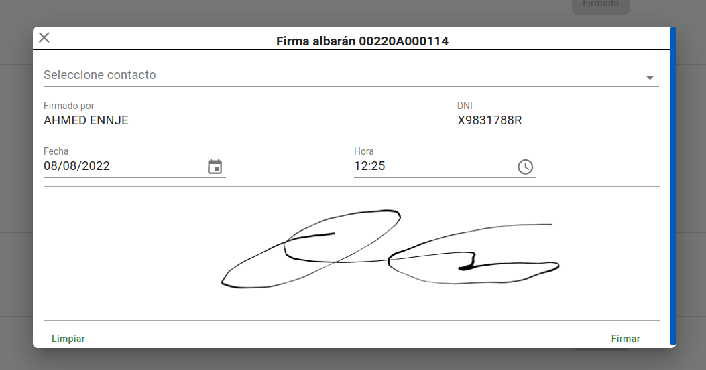

# Manual Firma de albaranes

## Configuración de puestos de firma

* Para crear los **puestos de firma** para cada usuario que vaya a utilizarlo en la WEBAPP. Para ello debemos ir a la parte del ERP la cual se encuentra en **Area de facturación -> Facturacion -> Puestos de firma**

* Crearemos un registro con nuestro nombre de usuario con el que nos conectamos a la WEBAPP.

## Firma de albaranes en WEBAPP

* Accederemos a la WEBAPP con nuestro usuario y contraseña y se nos mostrará el siguiente menú.

* Entraremos en la opción **Firmar** del menu de **Albaranes** donde seleccionaremos el albarán que vayamos a firmar.

* Previamente a la selección del albarán, podremos filtrar buscando un albaranes por los siguientes campos: **Codigo, Cliente, Firmado, Fecha**.

* Pulsaremos sobre el botón de firmar cuando tengamos localizado el albarán que vamos a firmar. Seleccionaremos el contacto y firmamos en la pantalla justo abajo de la fecha y hora.

* En caso de que nos hayamos confundido a la hora de firmar pulsaremos **Limpiar** el cual nos vaciará el campo de firma. En caso de que todo estuviera correcto pulsaremos sobre **Firmar** el cual terminará el proceso de firma.

### Más

  * [Volver al índice](../index.md)