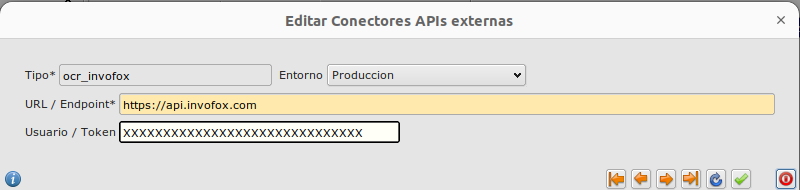
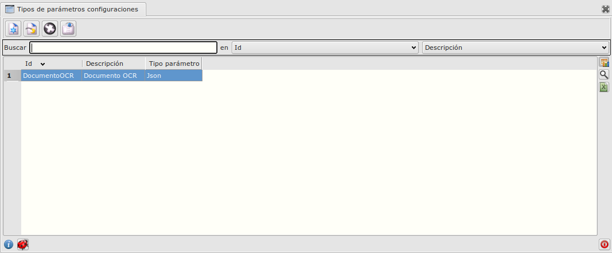
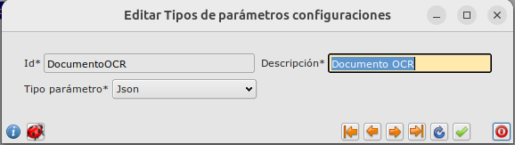
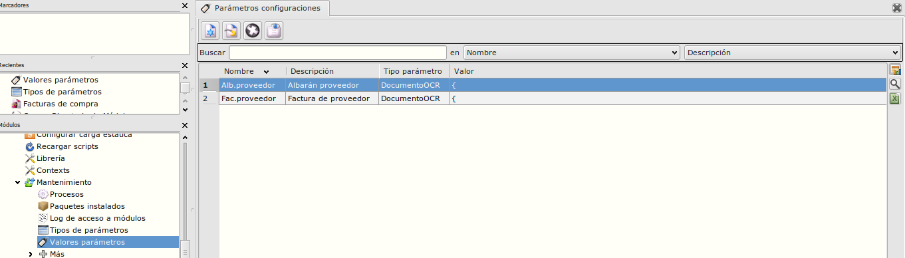
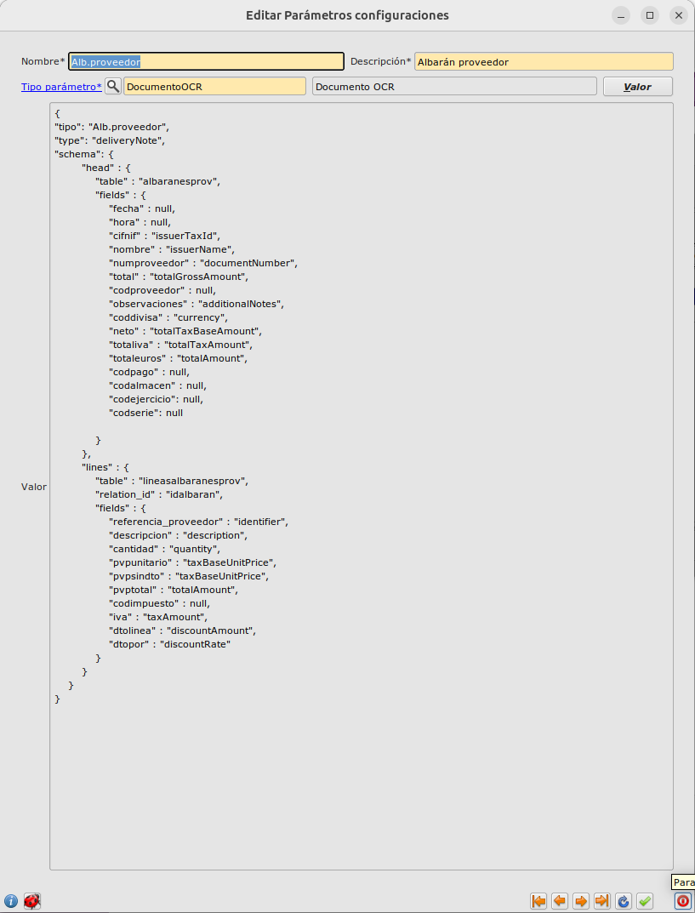
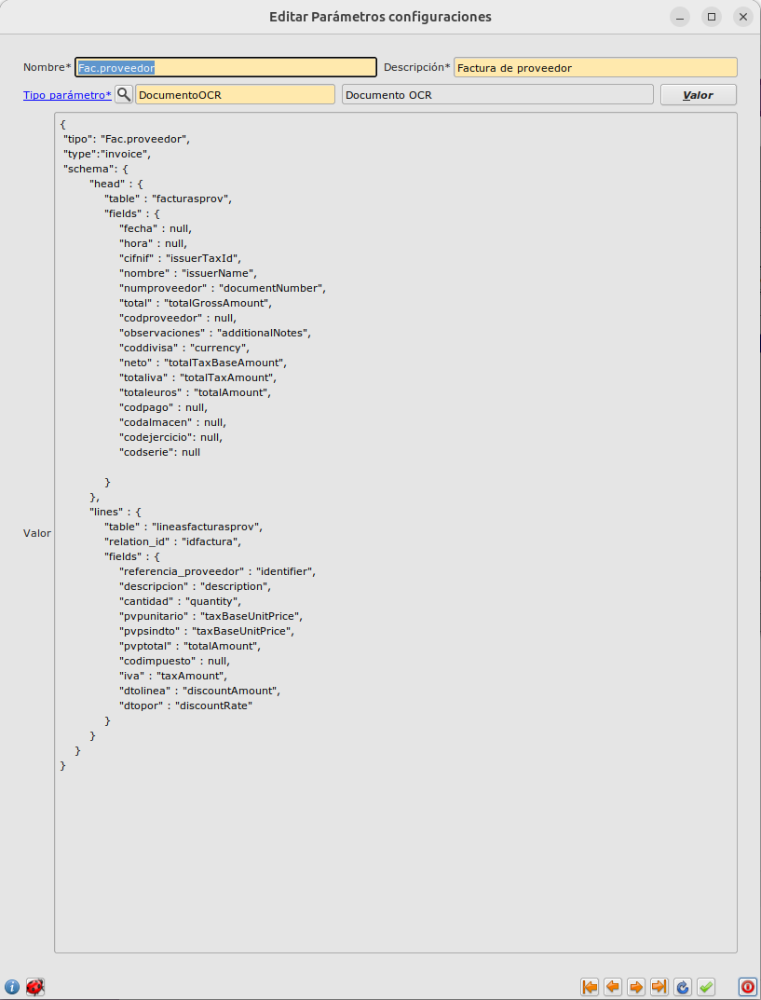

# Configuración OCR

## Datos de conexión

En ***Area de Facturación/principal/Más/Conectores*** especificamos la conexión (url y token) facilitada por Yeboyebo.

## Esquemas de datos

En ***Area de Sistema/Mantenimientos/Tipos de parámetros*** creamos un tipo llamado DocumentoOCR

En ***Area de Sistema/Mantenimientos/Valores parámetros*** hay que rellenar los esquemas de los albaranes y facturas de proveedor, especificando el tipo DocumentoOCR.

### Más

  * [Volver al índice](./index.md)