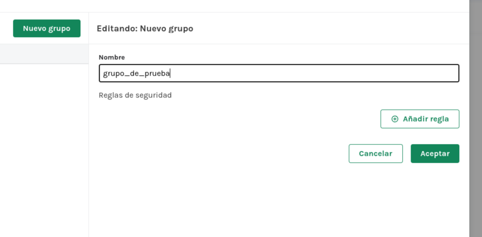
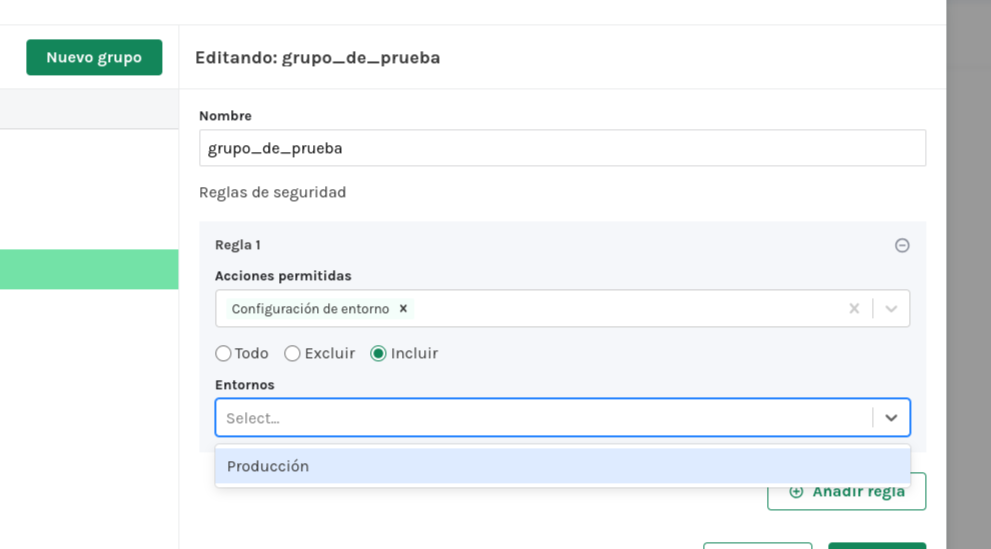
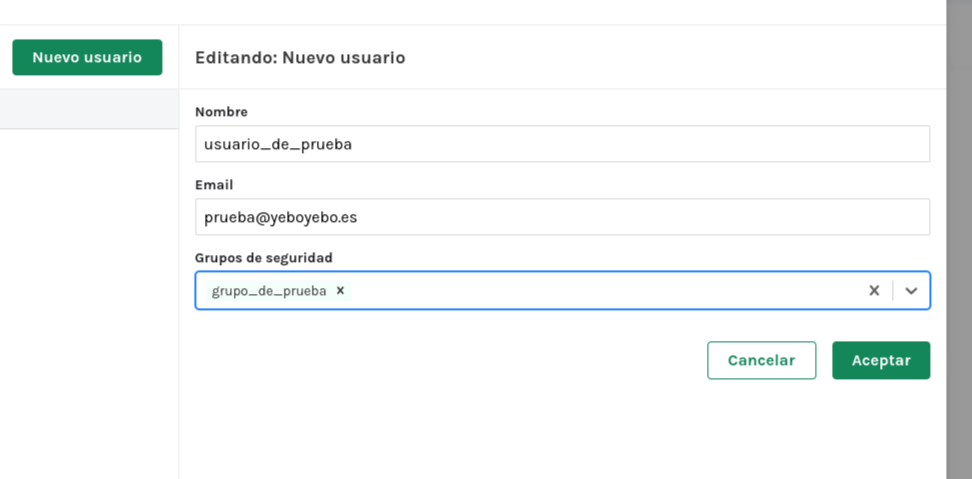
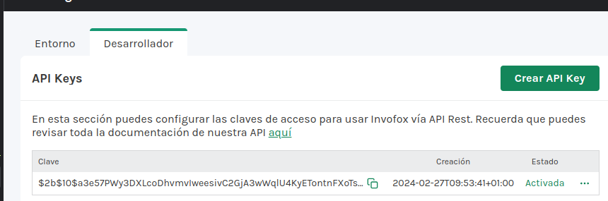
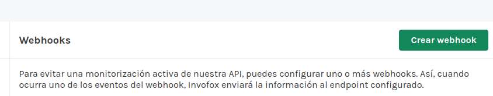
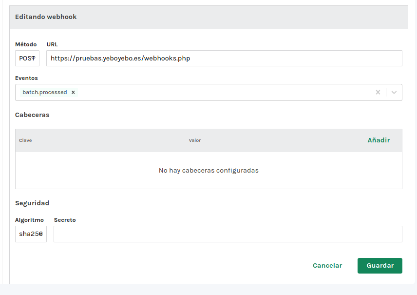

# Configuración Invofox

## Crear grupo

Para cada cliente se crea un grupo de suarios propio. de esta manera podremos tener los documentos aislados por cliente.

Al editar el grupo podemos asignarle un entorno

## Crear usuario

Añadimos los usuarios al grupo creado.

## Crear entorno

TODO: Creamos un entorno para el cliente.

## Asignar token al entorno

Dentro del entorno del cliente pulsamos sobre el botón ***Crear API Key*** y nos genera un token para que el cliente se autentique.

## Crear webhook

Al pulsar el botón ***Crear webhook*** rellenamos los datos de nuestro servidor para gestionar los avisos.

Hay que seleccionar el evento ***batch.processed***

### Más

  * [Volver al índice](./index.md)

