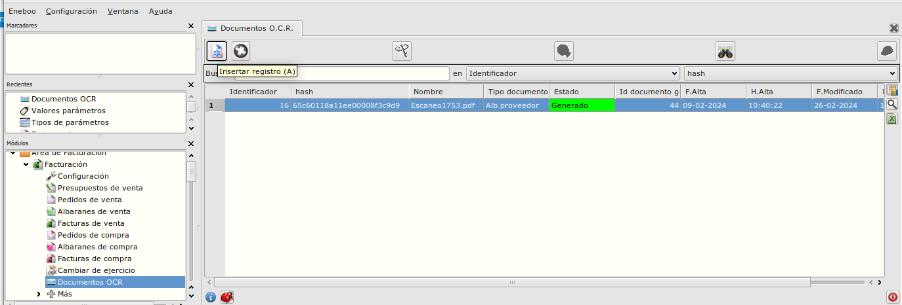
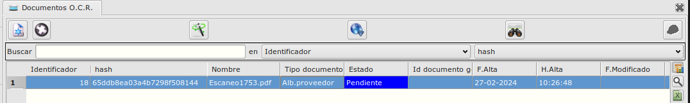
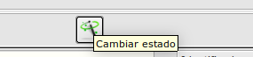
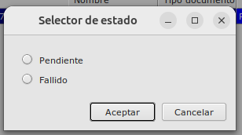
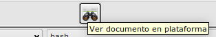
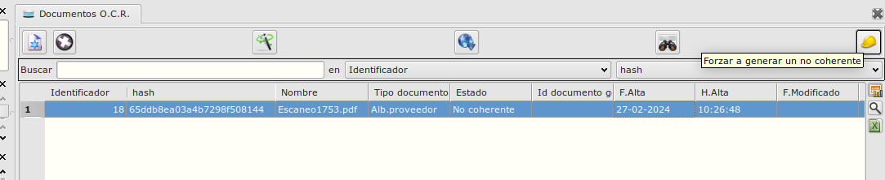

# Configuración OCR

## Procesar documentos

En ***Area de Facturación/facturacion/Documentos OCR*** gestionamos los documentos enviados a la plataforma

## Enviar un documento

Al pulsar sobre el botón de nuevo registro, aparecerá el siguiente formulario

Seleccionamos el fichero a enviar y pulsamos sobre ***Enviar***. Seguidamente aparecerá un registro nuevo en la tabla

## Comprobar estado

El documento se actualizará una vez reciba aiso de la plataforma remota de que ha terminado de ser procesado. el estado puede ser:
* Pendiente. El documento no tiene un estado definido todavía.
* Ilegible. El documento no se puede procesar de ninguna manera.
* Fallido. El documento tiene algun problema que requiere intervención humana.
* No coherente. El documento se considera válido, pero los valores totales de lineas o documento no coinciden.
* Generado. El documento ha generado un objeto en la base se datos.

También se puede comprobar el estado de manera manual, pulsando el botón ***comprobar estado actual***.

## Cambiar de estado

Si el estado no es ***Generado*** o ***Fallido*** se puede cambiar el estado a ***Pendiente*** o ***Fallido*** pulsando el botón ***Cambiar estado*** 

## Acceso a documento en plataforma

Se puede acceder al documento en la plataforma seleccionando la linea y pulsando sobre el botón ***ver documento en plataforma***

## Formar un documento no coherente

Si algún documento está en estado ***No coherente*** y aún así queremos que genere un objeto en BD, podemos pulsar el botón. Esto generará el documento.

### Más

  * [Volver al índice](./index.md)