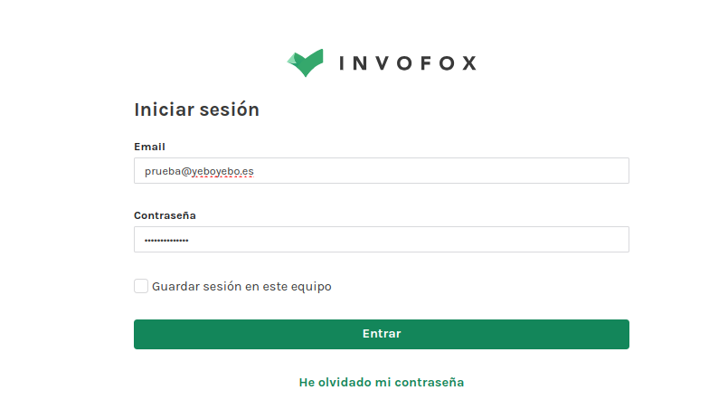
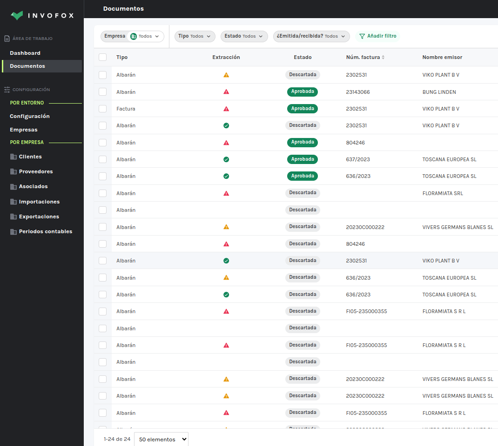
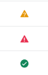
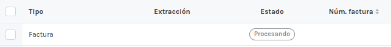
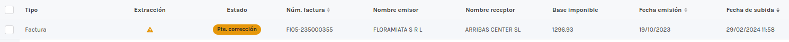
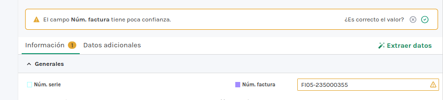
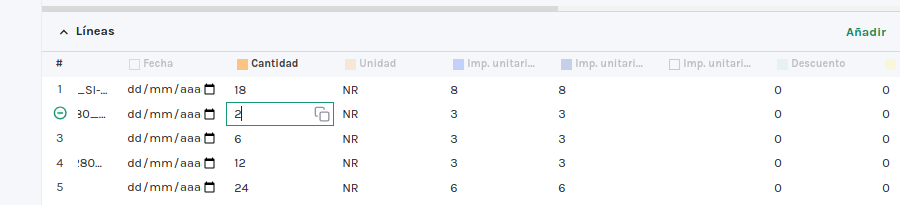
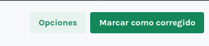
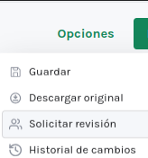

# Gestión documental Invofox

## Acceso

Entramos en app.invofox.com con usuario y contraseña asignados.

## Tabla de documentos

Entraremos en apartado documentos para ver nuesros documentos subidos a la plataforma.

En cada registro veremos un iciono dependiendo del nivel de estracción obtenido

## Procesar documento

El documento una vez enviado comenza en el estado ***Procesando***

Una vez procesado el documento, este cambiará a un estado según el nivel de extracción obtenido.

## Estado pendiente corrección

Este estado se informa porque algún dato parece incorrecto y se solicita intervención del usuario para resolver el problema.

Al pulsar sobre la linea accederemos a la vista del documento , donde podremos corregir el problema y confirmar cambios.

Uno de los problemas más comunes, en documentos con los que no está familiarizada la plataforma, es que los datos de las lineas pueden no ser coherentes.

## Validar documento

Cuando hemos realizado los cambios oportunos en los datos del documento y consideramos que los datos ya son coherentes, podemos pulser sobre ***Marcar como corregido*** , para que el documento cambie a estado ***Aprobada***. 

Si aún no tenemos claro que está mal en el documento podemos solicitar una revisión 

### Más

  * [Volver al índice](./index.md)